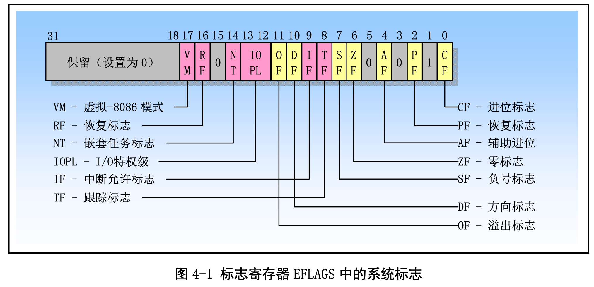
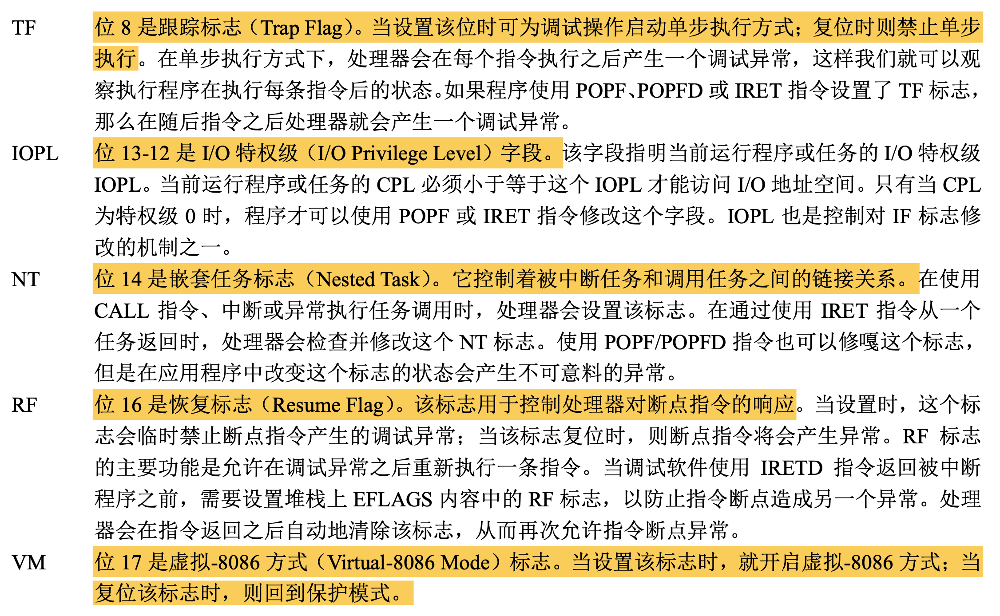
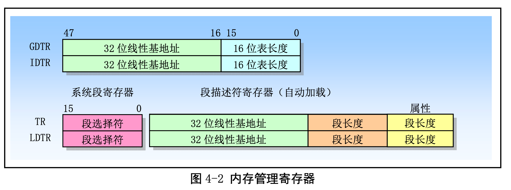
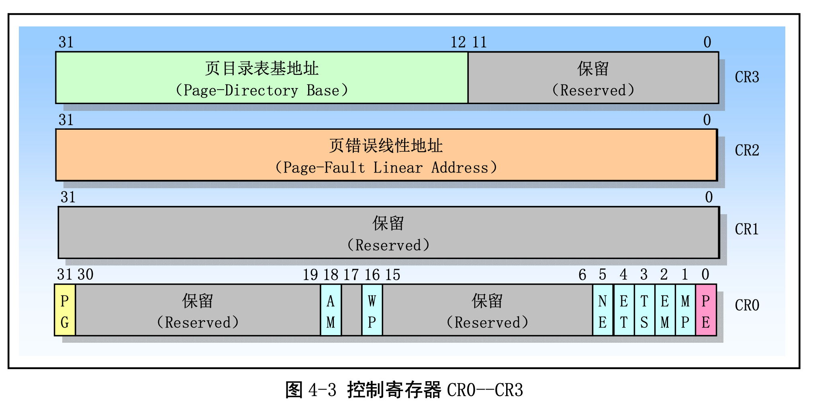
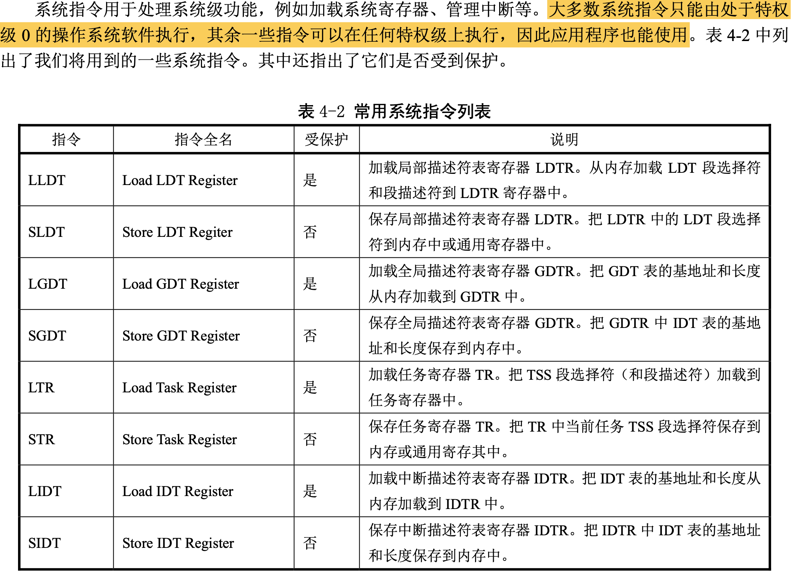
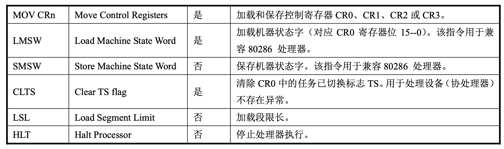

# 80X86寄存器和系统指令

## 1. 寄存器

### 1.1 标志寄存器EFLAGS

 

 

### 1.2 内存管理寄存器

 

### 1.3 控制寄存器

 

+ CR0：含有控制处理器操作模式和状态的系统控制标志；
+ CR1：保留不用；
+ CR2：含有导致页错误的线性地址；
+ CR3：含有页目录表物理内存基地址；

## 2. 系统指令

 

 

