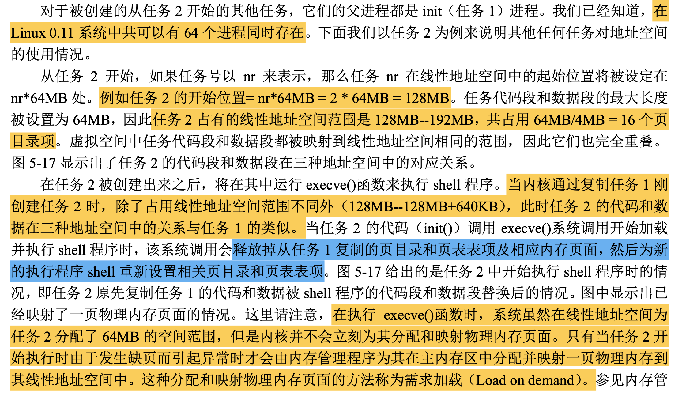

# Linux内核体系结构

 

## 1. Linux内核模式

 

+ Linux0.11采用的单内核模式；
+ 操作系统内核的结构模式可分为整体式的单内核模式和层次式的微内核模式；

## 2. Linux内核系统体系结构

+ 进程调度模块；
  + 负责控制进程对CPU资源的使用；
  + 所采取的调度策略使各进程能够公平合理地访问CPU，同时保证内核能及时地执行硬件操作；
+ 内存管理模块；
  + 用于确保所有进程能够安全地共享机器主内存区；
  + 支持虚拟内存管理方式，使得Linux支持进程使用比实际内存空间更多的内存容量，并利用文件系统将暂时不用的内存数据块交换到外部存储设备上去，当需要的时候再交换回来。
+ 文件系统模块；
  + 用于支持对外部设备的驱动和存储；
  + 虚拟文件系统模块通过向所有的外部存储设备提供一个通用的文件接口，隐藏了各种硬件设备的不同细节，从而提供并支持与其他操作系统兼容的多中文件系统格式；
+ 进程间通信模块；
  + 用于支持多种进程间的信息交换方式；
  + 主要通信模式：
    + 匿名管道；
    + 命名管道；
    + 信号；
    + 信号量；
    + 共享内存；
    + 消息队列；
    + Socket；
+ 网络接口模块；
  + 提供对多种网络通信标准的访问并支持许多网络硬件；

### 2.1 Linux内核系统模块结构及其相互依赖关系

 

### 2.2 Linux0.11内核结构框图

 

## 3. 内存管理

### 3.1 物理内存使用的功能分布图

 

### 3.2 虚拟地址到物理地址的变换过程

 

### 3.3 实模式下和保护模式下寻址方式对比

 

### 3.4 虚拟地址空间分配图

 

### 3.5 线性地址到物理地址的变换过程

 

### 3.6 线性地址空间使用示意图

 

 

 

## 4. 内存使用

 

### 4.1 任务0在三个地址空间的相互关系

 

由于任务0直接被包含在内核代码中，因此不需要为其再分配内存页。它运行时需要的内核态堆栈和用户态堆栈空间页都在内核代码区中，并且由于在内核初始化时（head.s）这些内存页面在页表项中都已经被设置成0b111，即对应页面用户可读写并且存在，因此用户堆栈user_stack[]空间虽然在内核空间中，但任务0仍然能对其进行读写操作。

### 4.2 任务1在三个地址空间的关系

 

 

### 4.3 其他任务在三个地址空间的关系

 

 

