# 分析键盘中断过程

## 参考资料

+ [博主1](https://blog.csdn.net/leoabcd12/article/details/122268321?ops_request_misc=%257B%2522request%255Fid%2522%253A%2522171115295416800222836403%2522%252C%2522scm%2522%253A%252220140713.130102334..%2522%257D&request_id=171115295416800222836403&biz_id=0&utm_medium=distribute.pc_search_result.none-task-blog-2~all~baidu_landing_v2~default-5-122268321-null-null.142%5Ev99%5Epc_search_result_base3&utm_term=%E5%93%88%E5%B7%A5%E5%A4%A7%E6%93%8D%E4%BD%9C%E7%B3%BB%E7%BB%9F%E6%9D%8E%E6%B2%BB%E5%86%9B%E5%AE%9E%E9%AA%8C&spm=1018.2226.3001.4187)

## 1. 注册键盘中断函数

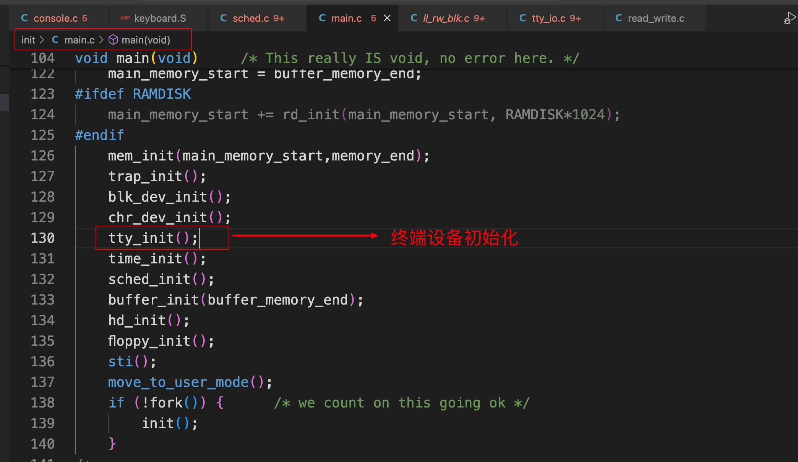 

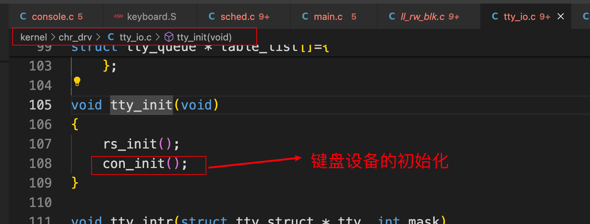 

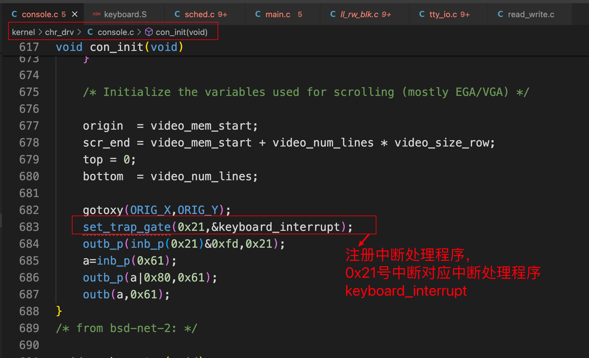 

 

 

## 2. 分析keyboard_interrupt

### 2.1 完整代码

kernel/chr_drv/keyboard.S

 

### 2.2 分析key_table

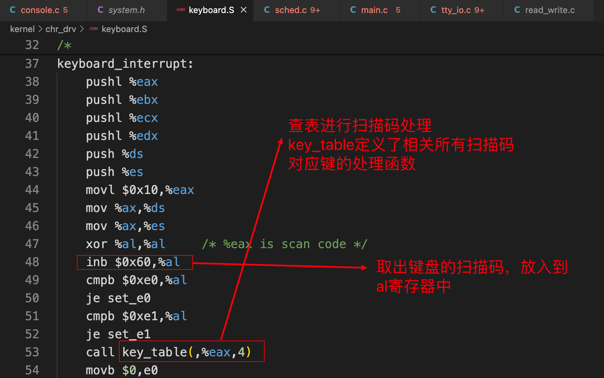 

#### 2.2.1 步骤一

key_table：

+ 主要功能：定义了相关所有扫描码对应键的处理函数；

+ 属于的文件：kernel/chr_drv/keyboard.S

+ 完整代码：

  ```assembly
  /*
   * This table decides which routine to call when a scan-code has been
   * gotten. Most routines just call do_self, or none, depending if
   * they are make or break.
   */
  key_table:
  	.long none,do_self,do_self,do_self	/* 00-03 s0 esc 1 2 */
  	.long do_self,do_self,do_self,do_self	/* 04-07 3 4 5 6 */
  	.long do_self,do_self,do_self,do_self	/* 08-0B 7 8 9 0 */
  	.long do_self,do_self,do_self,do_self	/* 0C-0F + ' bs tab */
  	.long do_self,do_self,do_self,do_self	/* 10-13 q w e r */
  	.long do_self,do_self,do_self,do_self	/* 14-17 t y u i */
  	.long do_self,do_self,do_self,do_self	/* 18-1B o p } ^ */
  	.long do_self,ctrl,do_self,do_self	/* 1C-1F enter ctrl a s */
  	.long do_self,do_self,do_self,do_self	/* 20-23 d f g h */
  	.long do_self,do_self,do_self,do_self	/* 24-27 j k l | */
  	.long do_self,do_self,lshift,do_self	/* 28-2B { para lshift , */
  	.long do_self,do_self,do_self,do_self	/* 2C-2F z x c v */
  	.long do_self,do_self,do_self,do_self	/* 30-33 b n m , */
  	.long do_self,minus,rshift,do_self	/* 34-37 . - rshift * */
  	.long alt,do_self,caps,func		/* 38-3B alt sp caps f1 */
  	.long func,func,func,func		/* 3C-3F f2 f3 f4 f5 */
  	.long func,func,func,func		/* 40-43 f6 f7 f8 f9 */
  	.long func,num,scroll,cursor		/* 44-47 f10 num scr home */
  	.long cursor,cursor,do_self,cursor	/* 48-4B up pgup - left */
  	.long cursor,cursor,do_self,cursor	/* 4C-4F n5 right + end */
  	.long cursor,cursor,cursor,cursor	/* 50-53 dn pgdn ins del */
  	.long none,none,do_self,func		/* 54-57 sysreq ? < f11 */
  	.long func,none,none,none		/* 58-5B f12 ? ? ? */
  	.long none,none,none,none		/* 5C-5F ? ? ? ? */
  	.long none,none,none,none		/* 60-63 ? ? ? ? */
  	.long none,none,none,none		/* 64-67 ? ? ? ? */
  	.long none,none,none,none		/* 68-6B ? ? ? ? */
  	.long none,none,none,none		/* 6C-6F ? ? ? ? */
  	.long none,none,none,none		/* 70-73 ? ? ? ? */
  	.long none,none,none,none		/* 74-77 ? ? ? ? */
  	.long none,none,none,none		/* 78-7B ? ? ? ? */
  	.long none,none,none,none		/* 7C-7F ? ? ? ? */
  	.long none,none,none,none		/* 80-83 ? br br br */
  	.long none,none,none,none		/* 84-87 br br br br */
  	.long none,none,none,none		/* 88-8B br br br br */
  	.long none,none,none,none		/* 8C-8F br br br br */
  	.long none,none,none,none		/* 90-93 br br br br */
  	.long none,none,none,none		/* 94-97 br br br br */
  	.long none,none,none,none		/* 98-9B br br br br */
  	.long none,unctrl,none,none		/* 9C-9F br unctrl br br */
  	.long none,none,none,none		/* A0-A3 br br br br */
  	.long none,none,none,none		/* A4-A7 br br br br */
  	.long none,none,unlshift,none		/* A8-AB br br unlshift br */
  	.long none,none,none,none		/* AC-AF br br br br */
  	.long none,none,none,none		/* B0-B3 br br br br */
  	.long none,none,unrshift,none		/* B4-B7 br br unrshift br */
  	.long unalt,none,uncaps,none		/* B8-BB unalt br uncaps br */
  	.long none,none,none,none		/* BC-BF br br br br */
  	.long none,none,none,none		/* C0-C3 br br br br */
  	.long none,none,none,none		/* C4-C7 br br br br */
  	.long none,none,none,none		/* C8-CB br br br br */
  	.long none,none,none,none		/* CC-CF br br br br */
  	.long none,none,none,none		/* D0-D3 br br br br */
  	.long none,none,none,none		/* D4-D7 br br br br */
  	.long none,none,none,none		/* D8-DB br ? ? ? */
  	.long none,none,none,none		/* DC-DF ? ? ? ? */
  	.long none,none,none,none		/* E0-E3 e0 e1 ? ? */
  	.long none,none,none,none		/* E4-E7 ? ? ? ? */
  	.long none,none,none,none		/* E8-EB ? ? ? ? */
  	.long none,none,none,none		/* EC-EF ? ? ? ? */
  	.long none,none,none,none		/* F0-F3 ? ? ? ? */
  	.long none,none,none,none		/* F4-F7 ? ? ? ? */
  	.long none,none,none,none		/* F8-FB ? ? ? ? */
  	.long none,none,none,none		/* FC-FF ? ? ? ? */
  ```

+ 重要片段：

 

下面进入到func函数的分析；也就是跳到步骤二；

#### 2.2.2 步骤二

func：

+ 主要功能：将f1-f12功能键进行转义处理，处理完毕后将扫描码放入到键盘输入队列中；

+ 属于的文件：kernel/chr_drv/keyboard.S

+ 完整代码：

  ```assembly
  /*
   * this routine handles function keys
   */
  func:
  	pushl %eax
  	pushl %ecx
  	pushl %edx
  	call show_stat
  	popl %edx
  	popl %ecx
  	popl %eax
  	subb $0x3B,%al
  	jb end_func
  	cmpb $9,%al
  	jbe ok_func
  	subb $18,%al
  	cmpb $10,%al
  	jb end_func
  	cmpb $11,%al
  	ja end_func
  ok_func:
  	cmpl $4,%ecx		/* check that there is enough room */
  	jl end_func
  	movl func_table(,%eax,4),%eax
  	xorl %ebx,%ebx
  	jmp put_queue
  end_func:
  	ret
  ```

+ 重要片段

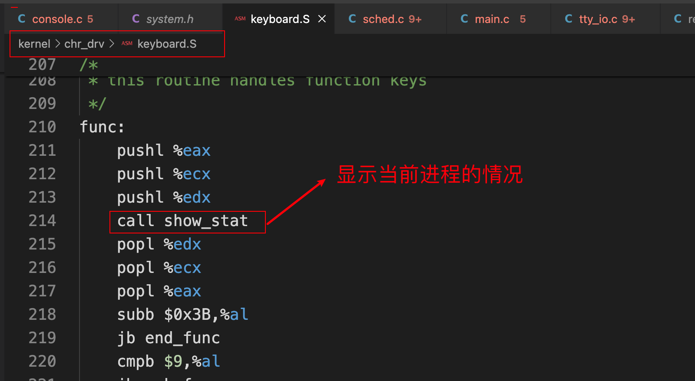 

浅浅看一下show_stat：

 

继续分析func：

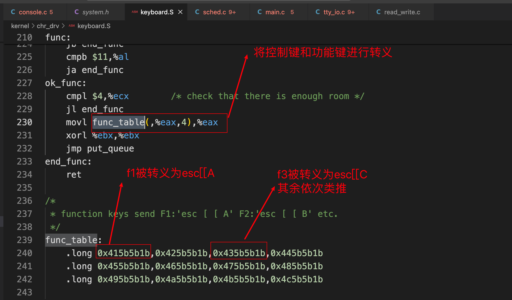 

 

浅浅看一下put_queue：

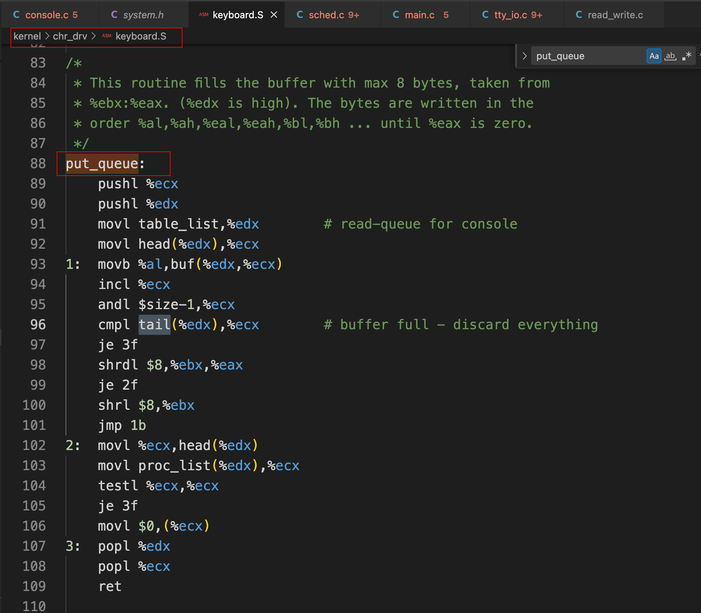  

### 2.3 分析do_tty_interrupt

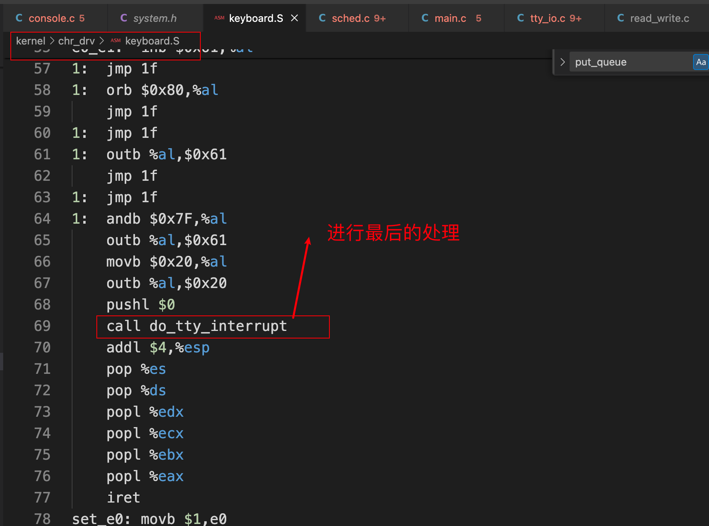 

#### 2.3.1 步骤一 

do_tty_interrupt：

+ 主要功能：直接调用copy_to_cooked函数对队列中的字符进行判断处理；
+ 该函数的参数：
  + 参数1=0；

+ 属于的文件：kernel/chr_drv/tty_io.c

+ 完整代码：

  ```c
  /*
   * Jeh, sometimes I really like the 386.
   * This routine is called from an interrupt,
   * and there should be absolutely no problem
   * with sleeping even in an interrupt (I hope).
   * Of course, if somebody proves me wrong, I'll
   * hate intel for all time :-). We'll have to
   * be careful and see to reinstating the interrupt
   * chips before calling this, though.
   *
   * I don't think we sleep here under normal circumstances
   * anyway, which is good, as the task sleeping might be
   * totally innocent.
   */
  void do_tty_interrupt(int tty)
  {
  	copy_to_cooked(tty_table+tty);
  }
  ```

+ 重要片段：

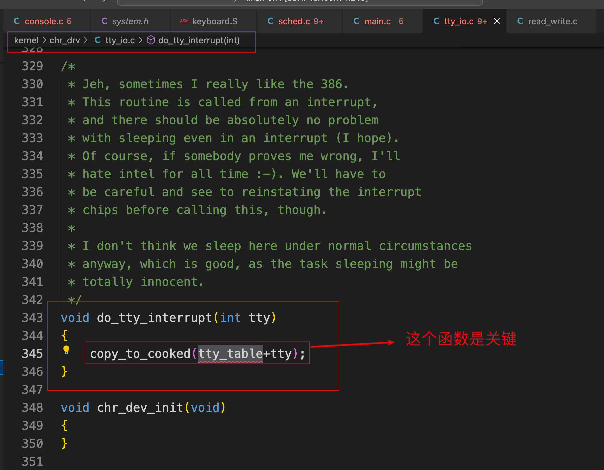 

tty_table的样子：

 

```c
struct tty_struct tty_table[] = {
	{
		{ICRNL,		/* change incoming CR to NL */
		OPOST|ONLCR,	/* change outgoing NL to CRNL */
		0,
		ISIG | ICANON | ECHO | ECHOCTL | ECHOKE,
		0,		/* console termio */
		INIT_C_CC},
		0,			/* initial pgrp */
		0,			/* initial stopped */
		con_write,
		{0,0,0,0,""},		/* console read-queue */
		{0,0,0,0,""},		/* console write-queue */
		{0,0,0,0,""}		/* console secondary queue */
	},{
		{0, /* no translation */
		0,  /* no translation */
		B2400 | CS8,
		0,
		0,
		INIT_C_CC},
		0,
		0,
		rs_write,
		{0x3f8,0,0,0,""},		/* rs 1 */
		{0x3f8,0,0,0,""},
		{0,0,0,0,""}
	},{
		{0, /* no translation */
		0,  /* no translation */
		B2400 | CS8,
		0,
		0,
		INIT_C_CC},
		0,
		0,
		rs_write,
		{0x2f8,0,0,0,""},		/* rs 2 */
		{0x2f8,0,0,0,""},
		{0,0,0,0,""}
	}
};
```

接下来跳到步骤二；

#### 2.3.2 步骤二

copy_to_cooked：

+ 属于的文件：kernel/chr_drv/tty_io.c
+ 该函数的参数：

 

+ 完整代码：

  ```c
  void copy_to_cooked(struct tty_struct * tty)
  {
  	signed char c;
  
  	while (!EMPTY(tty->read_q) && !FULL(tty->secondary)) {
  		GETCH(tty->read_q,c);
  		if (c==13)
  			if (I_CRNL(tty))
  				c=10;
  			else if (I_NOCR(tty))
  				continue;
  			else ;
  		else if (c==10 && I_NLCR(tty))
  			c=13;
  		if (I_UCLC(tty))
  			c=tolower(c);
  		if (L_CANON(tty)) {
  			if (c==KILL_CHAR(tty)) {
  				/* deal with killing the input line */
  				while(!(EMPTY(tty->secondary) ||
  				        (c=LAST(tty->secondary))==10 ||
  				        c==EOF_CHAR(tty))) {
  					if (L_ECHO(tty)) {
  						if (c<32)
  							PUTCH(127,tty->write_q);
  						PUTCH(127,tty->write_q);
  						tty->write(tty);
  					}
  					DEC(tty->secondary.head);
  				}
  				continue;
  			}
  			if (c==ERASE_CHAR(tty)) {
  				if (EMPTY(tty->secondary) ||
  				   (c=LAST(tty->secondary))==10 ||
  				   c==EOF_CHAR(tty))
  					continue;
  				if (L_ECHO(tty)) {
  					if (c<32)
  						PUTCH(127,tty->write_q);
  					PUTCH(127,tty->write_q);
  					tty->write(tty);
  				}
  				DEC(tty->secondary.head);
  				continue;
  			}
  			if (c==STOP_CHAR(tty)) {
  				tty->stopped=1;
  				continue;
  			}
  			if (c==START_CHAR(tty)) {
  				tty->stopped=0;
  				continue;
  			}
  		}
  		if (L_ISIG(tty)) {
  			if (c==INTR_CHAR(tty)) {
  				tty_intr(tty,INTMASK);
  				continue;
  			}
  			if (c==QUIT_CHAR(tty)) {
  				tty_intr(tty,QUITMASK);
  				continue;
  			}
  		}
  		if (c==10 || c==EOF_CHAR(tty))
  			tty->secondary.data++;
  		if (L_ECHO(tty)) {
  			if (c==10) {
  				PUTCH(10,tty->write_q);
  				PUTCH(13,tty->write_q);
  			} else if (c<32) {
  				if (L_ECHOCTL(tty)) {
  					PUTCH('^',tty->write_q);
  					PUTCH(c+64,tty->write_q);
  				}
  			} else
  				PUTCH(c,tty->write_q);
  			tty->write(tty);
  		}
  		PUTCH(c,tty->secondary);
  	}
  	wake_up(&tty->secondary.proc_list);
  }
  ```

+ 片段分析

重要结构体：

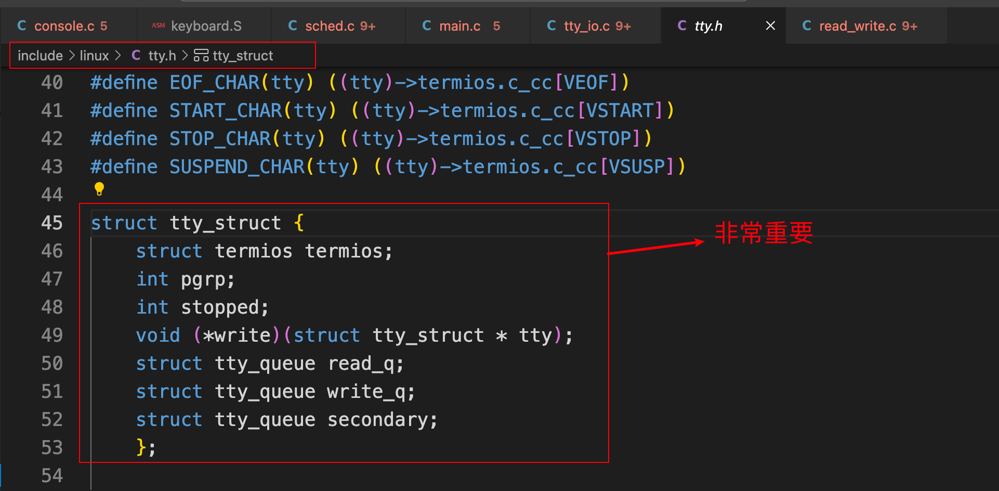 

 

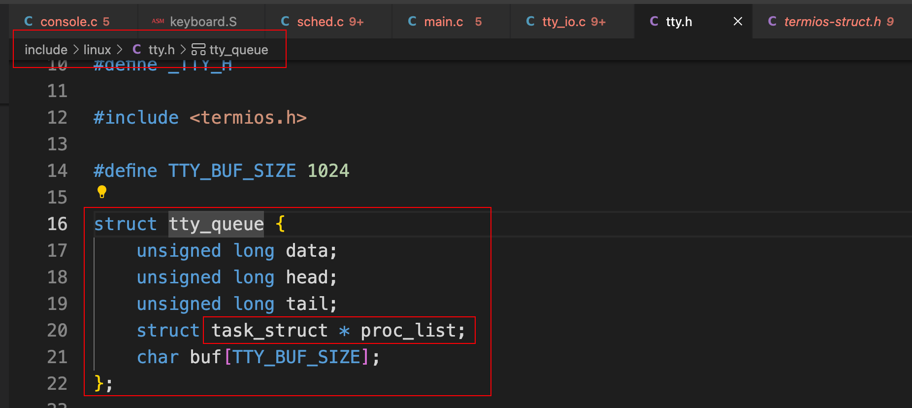 

对比参数：

 

`tty->write(tty)`等价于`tty->con_write(tty)`

con_write函数负责将其输出到显卡内存；

## 3. 补充知识

### 3.1  字符输出流程

无论是输出字符到屏幕上还是文件中，系统最终都会调用write函数来进行；

而write函数则会调用sys_write系统调用来实现字符输出；

+ 如果是输出到屏幕上，则会调用tty_write函数，而tty_write函数最终会调用con_write函数将字符输出；
+ 如果是输出到文件中，则会调用file_write函数直接将字符输出到指定的文件缓存区中；

所以无论是键盘输入的回显，还是程序的字符输出，都只需要修改con_write函数中最终写到显存中的字符就可以了。

但是如果要控制字符输出到文件中，则需要修改file_write函数中输出到文件缓冲区中的字符即可。

### 3.2 键盘处理流程

 


 

