# 分析fork的内存管理

## 1. 从fork到sys_fork

### 1.1 fork函数的样子

系统调用没有参数的宏：

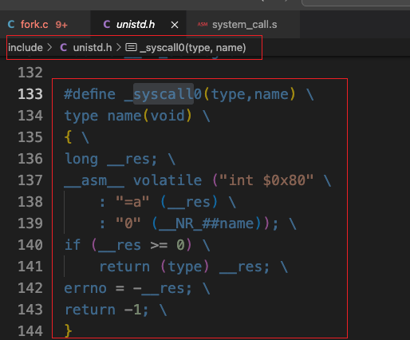 

这是一个宏，会展开：

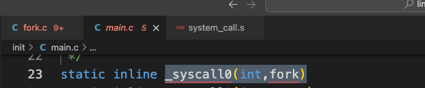 

这个宏展开的样子：

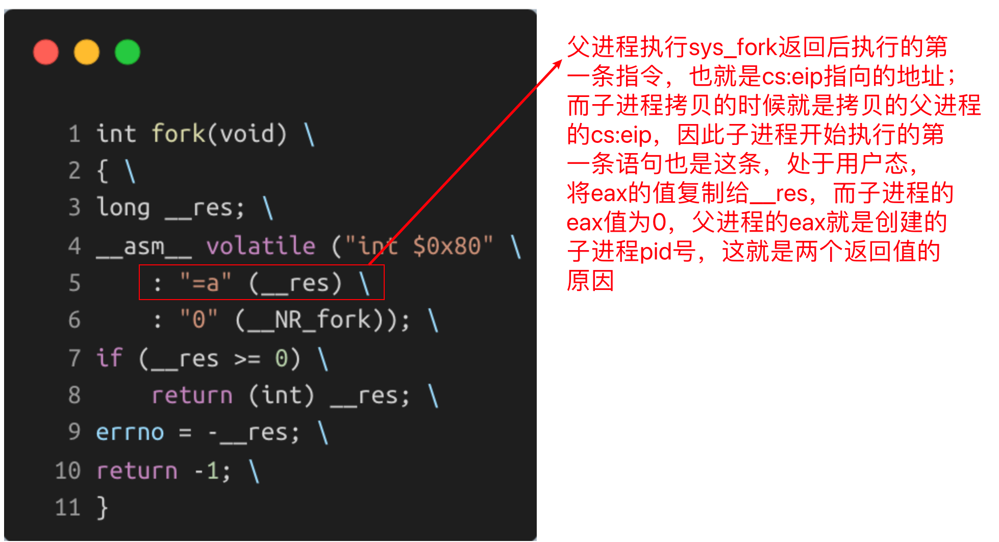 

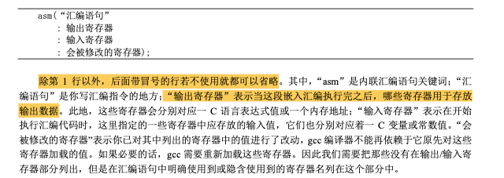 

### 1.2 fork到sys_fork过程

在`sched_init`函数中向中断向量表idt注册0x80中断处理函数`system_call`：

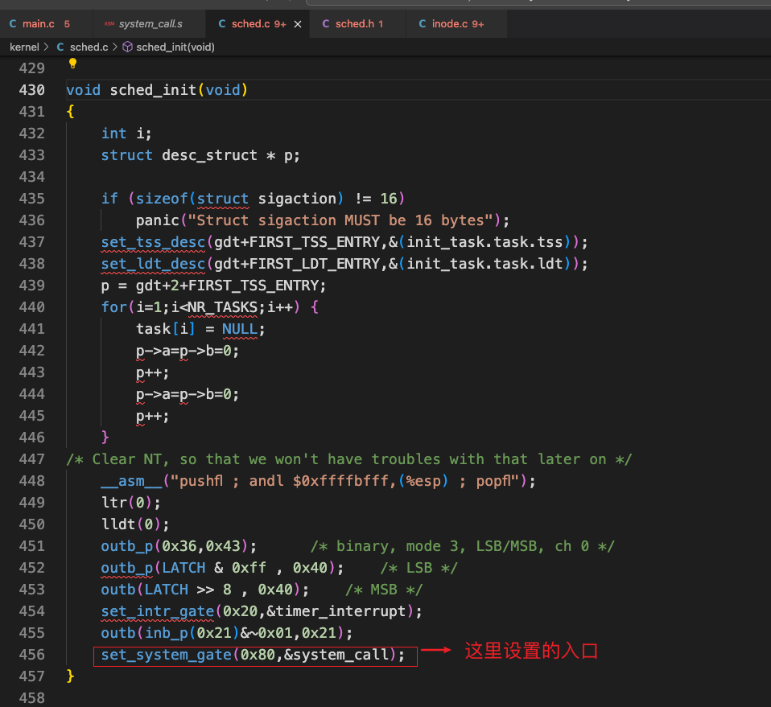 

`system_call`的实现：

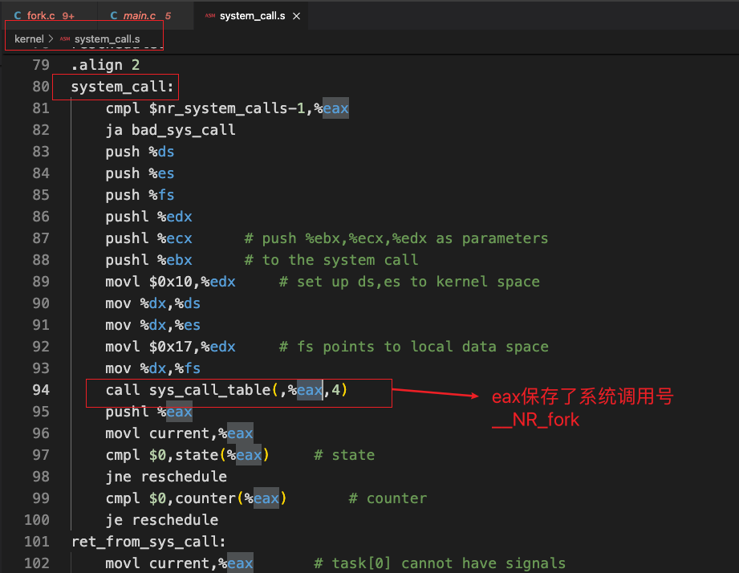 

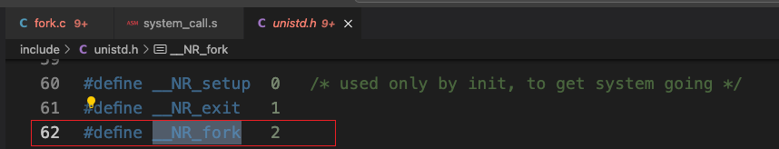 

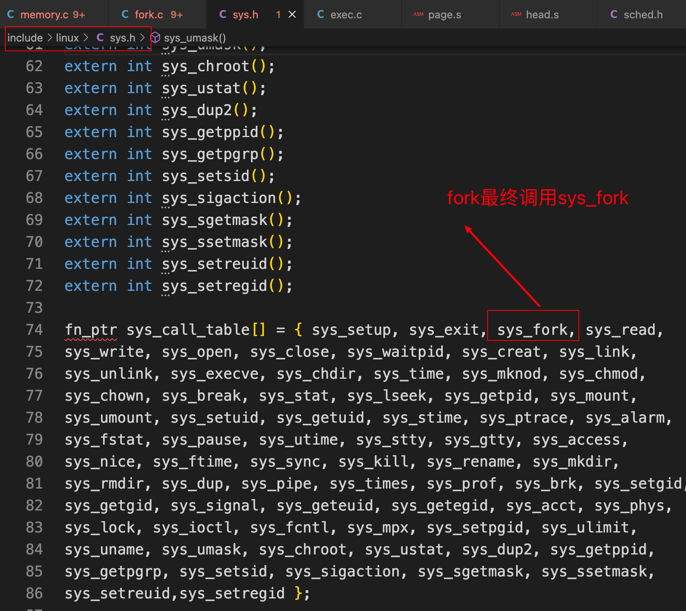 

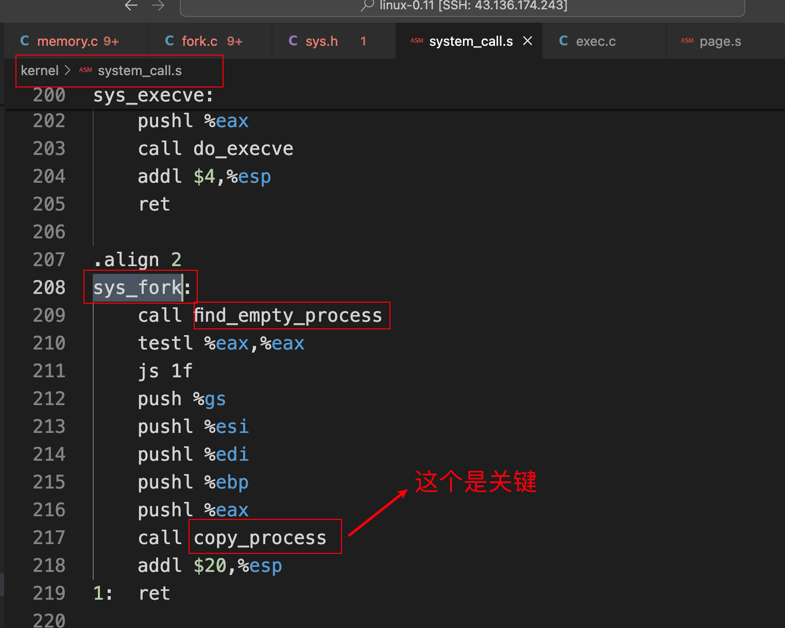 

### 1.3 小结

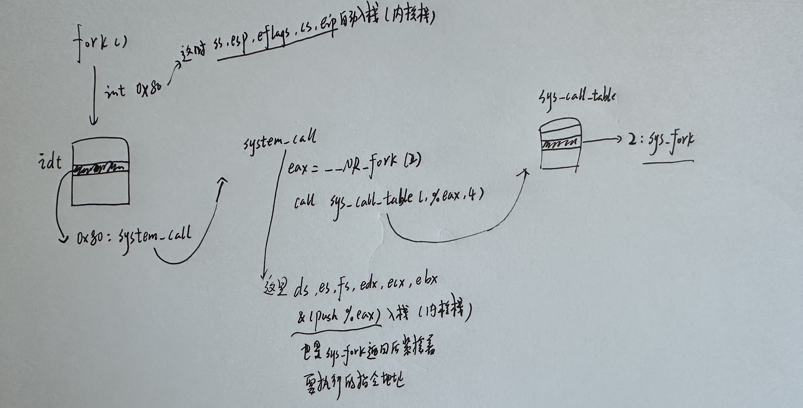 

用户态的`fork()`API通过执行`int $0x80`这个编程异常，可以从用户态进入到内核态。

具体来说，**在由用户态进入内核时，CPU的保护机制检测到特权级发生了变化，会自动将用户态程序在执行`int $0x80`时的`ss`,`esp`,`eflags`,`cs`,`eip`这5个寄存器的值顺序压入到进程0的内核栈中**。

`main`函数在执行`iret`指令返回到用户态时的内核堆栈，不含有额外的参数，与`fork()`API触发编程异常进入内核时由CPU自动压入到进程0的内核栈的内容一样，只包含和用户态信息有关的这5个寄存器的值。

同时注意到此时进程0的内核栈中`cs:eip`指向`int $0x80`指令紧接着的下一条指令，该指令的作用是将`fork`系统调用保存在eax中的返回值写入到`fork()`API的返回值`__res`变量中。

在CPU自动将上面提到的5个寄存器的内容压入到进程0的内核栈之后，便开始跳转到`system_call`中断处理函数执行(这是由于`int $0x80`编程异常在IDT表中对应的描述符项的基地址被设置为`system_call`的入口地址)。

`system_call`又接着将`ds`,`es`,`fs`这3个寄存器的内容压栈，接着将保存着系统调用参数的`edx`,`ecx`,`ebx`这3个寄存器的内容压栈(尽管`fork()`API没有参数)。然后根据保存在eax寄存器中的系统调用号`__NR_fork`在`sys_call_table`中查找到`fork()`API对应的内核实现函数`sys_fork`，并跳转到`sys_fork`执行。跳转到`sys_fork`执行时进程0内核栈的样子如下图所示：

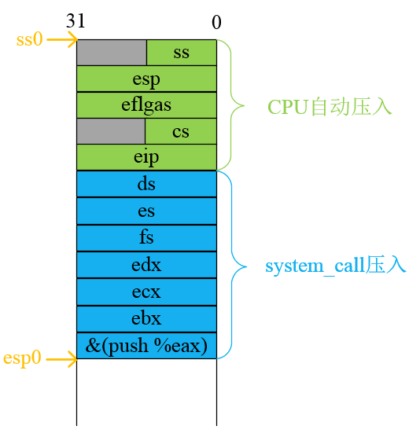 

其中`&(push %eax)`是`system_call`调用`sys_fork`返回后紧接着要执行的指令地址。

## 2. 分析find_empty_process

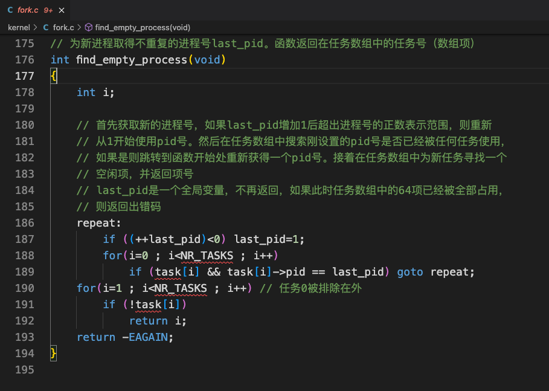 

执行这个函数之后：

+ 返回值是新任务在任务数组task中的下标nr；
+ last_pid修改为为新进程取得的不重复的进程号；

`find_empty_process`为新建进程找到pid号和`task`数组中存放新建进程PCB地址的位置后，以该位置下标作为返回值返回。紧接着`sys_fork`将`gs`,`esi`,`edi`,`ebp`以及保存着`find_empty_process`返回值的`eax`寄存器顺序压栈，调用`copy_process`开始为新建进程复制父进程的代码段和数据段以及环境。在调用`copy_process`时进程0内核态堆栈的结构如下图所示：

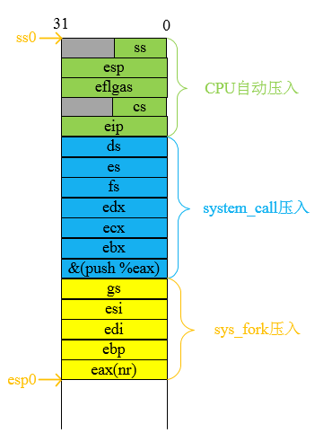 

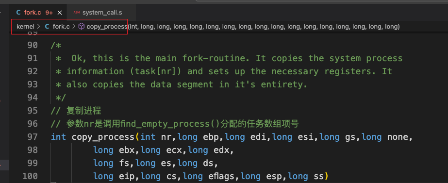 

对照上面提到的在调用`copy_process`时进程0的内核栈的结构，我们可以看出汇编程序在调用c函数时的参数传递机制：**汇编程序需要逆序将c函数需要的参数压入栈中**，即c函数最后(最右边的)一个参数先入栈，而最左边的第1个参数在最后调用指令`call copy_process`之前入栈。然后执行`call`指令去执行被调用的函数。

另外，**如果c函数的返回值是一个整数或指针，那么寄存器eax将被默认用来传递返回值**。

## 3. 分析copy_process

### 3.1 完整代码

kernel/fork.c

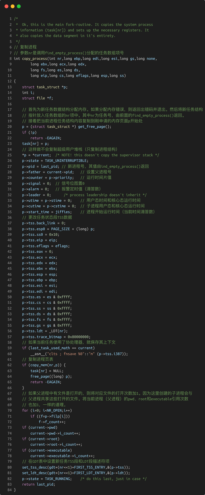  

`copy_process`首先申请1页内存用于存放新建进程的PCB数据，并将该页的首地址转换为`task_struct`结构后赋值给`task[nr]`元素，而`nr`就是保存在eax寄存器的`find_empty_process`的返回值，即`find_empty_process`为新建进程在`task`数组找到用于存放其PCB地址的元素的下标。

然后复制父进程的PCB数据到新建的子进程。所以子进程的代码段有关的寄存器`cs:eip`，数据段有关的寄存器`ds`,`es`,`fs`,`gs`,`esi`,`edi`，用户态堆栈有关的寄存器`ss:esp`都和父进程的一样。

当然也不是所有数据简单复制父进程的就可以，还要做必要的修改。

其中：

+ 将子进程的pid设置为`find_empty_process`找到的`last_pid`的值；
+ 将子进程的状态先设置为等待状态，等完成数据复制和修改操作后，再将子进程的状态修改为就绪态，以便可以得到操作系统调度；
+ 将子进程的eax寄存器的值置为0，作为子进程调度后的“类似父进程的从内核中断处理函数`system_call`返回”(实际是从返回处执行，并不是返回)的返回值。
+ 将子进程的内核态堆栈的堆栈栈顶指针设置在该新建页的尾端地址，设置子进程的TSS中的LDT的选择符ldt为子进程自己的值。
+ 调用`copy_mem`为子进程分配线性地址空间地址，指定段限长，以这些值进一步修改子进程PCB中的LDT中的代码段和数据段的基地址和段限长，然后`copy_mem`又调用`copy_page_tables`为子进程分配页表空间复制父进程的页表内容并修改父子进程的页表项的属性为只读，为写时复制(Copy On Write, COW)技术做准备。
+ 最后，`copy_mem`返回到`copy_process`中，设置好新建进程在GDT表中的TSS描述符和LDT描述符后，`copy_process`以新建进程的pid号即`last_pid`作为返回值返回到`sys_fork`中。`sys_fork`拆除`copy_process`的函数栈帧后返回到中断处理函数`system_call`中。

### 3.2 逐步分析

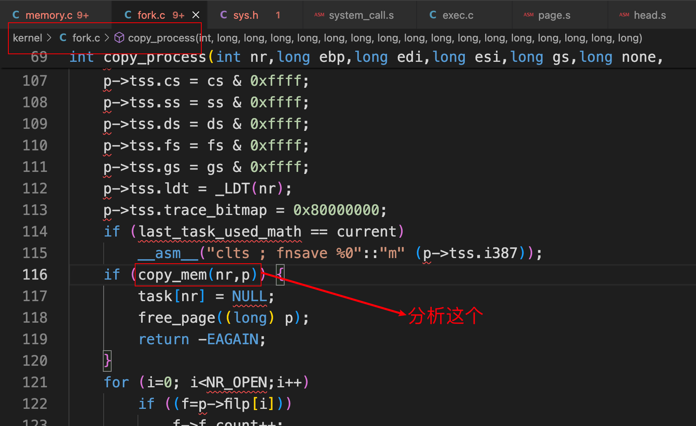 

## 4. 分析copy_mem

### 4.1 完整代码

kernel/fork.c

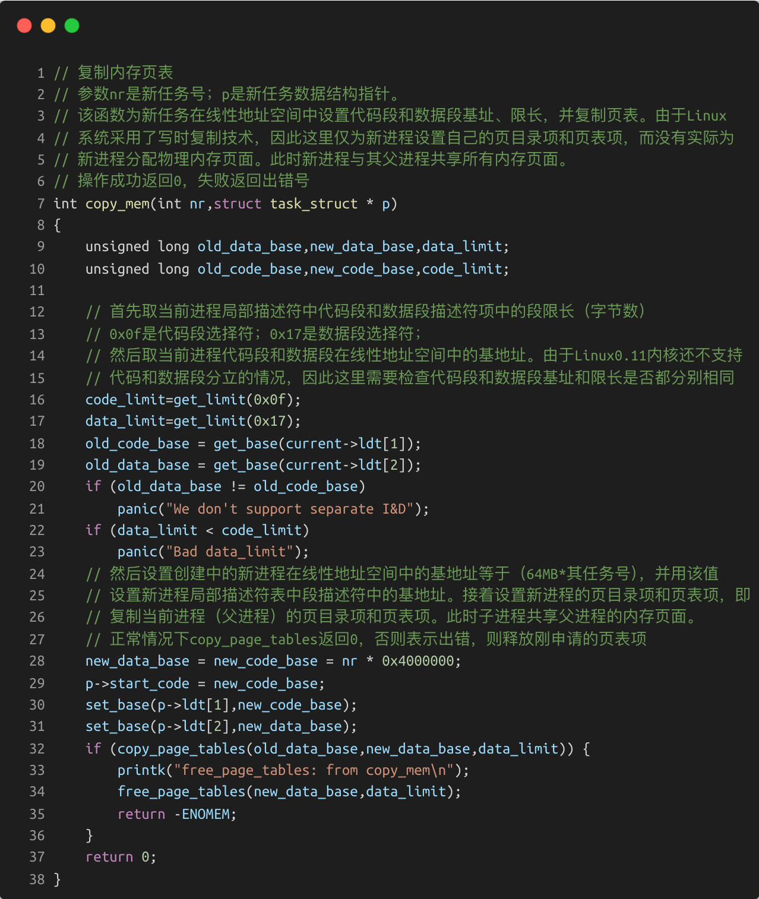  

### 4.2 逐步分析

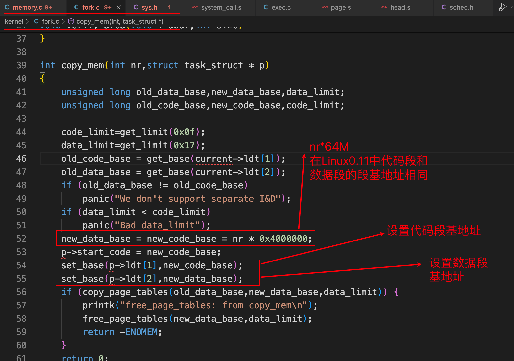 

浅浅看一下set_base：

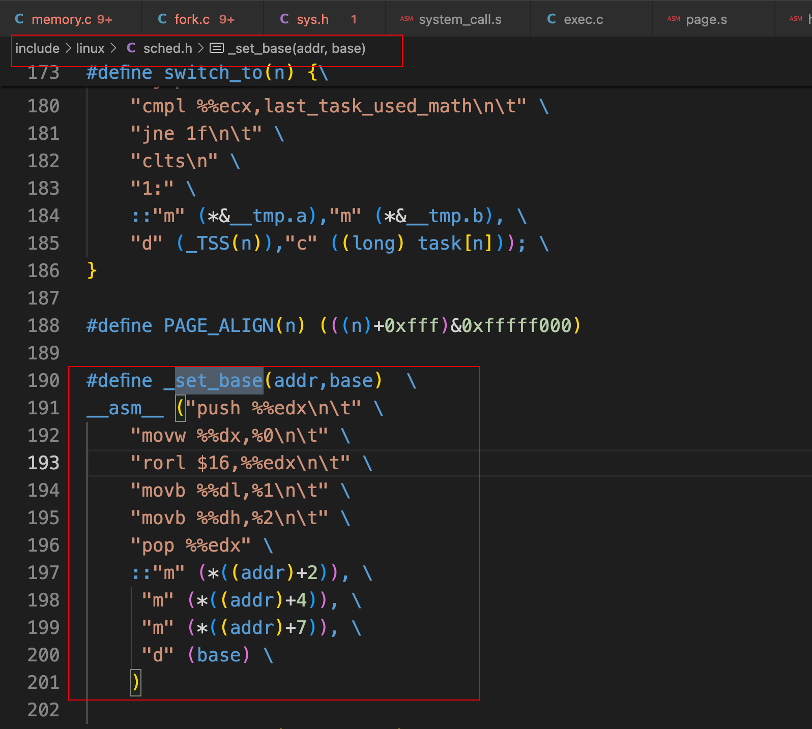 

插入进程虚拟地址分配后的样子：

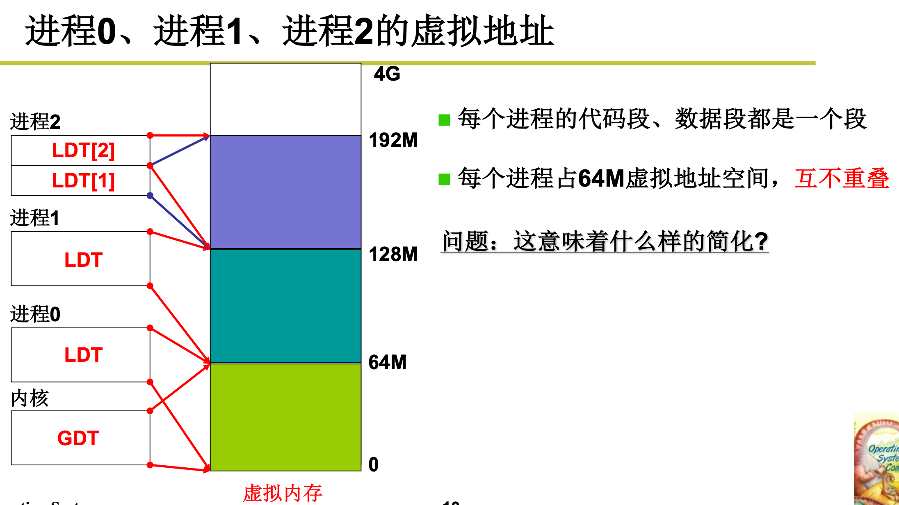 


继续分析copy_mem，现在该轮到分配内存，创建页表了：

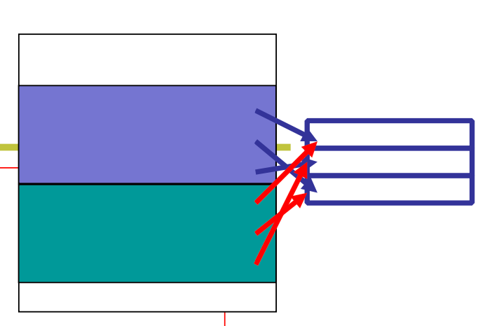 

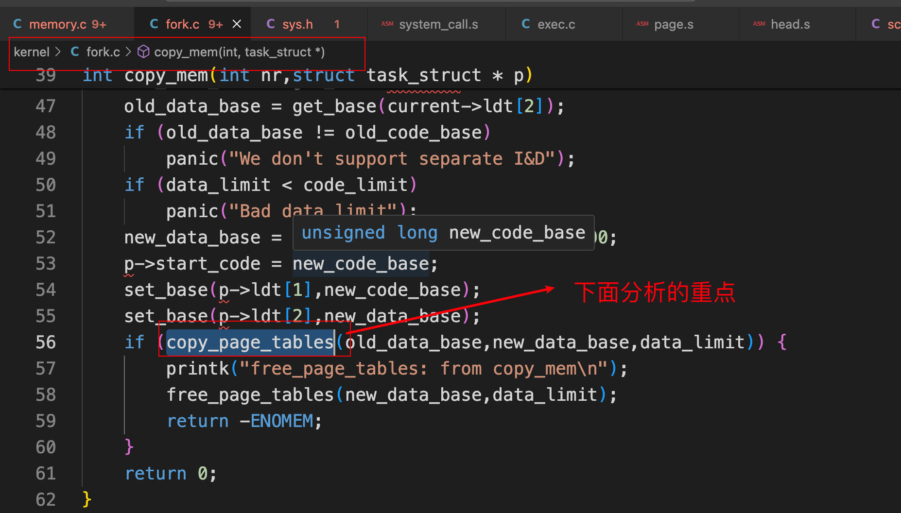 

## 5. 分析copy_page_tables

### 5.1 完整代码

mm/memory.c

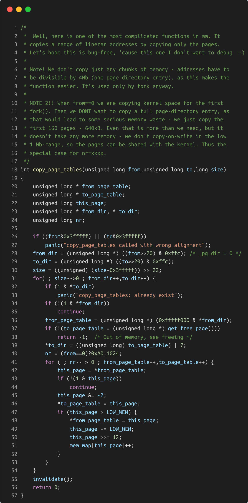  

### 5.2 逐步分析

#### 5.2.1 变量的含义

+ `unsigned long * from_page_table;`
  + 含义：指向源页表基地址的指针；
+ `unsigned long * to_page_table;`
  + 含义：指向目标页表基地址的指针；
+ `unsigned long * from_dir;`
  + 含义：指向源页目录表基地址的指针；
+ `unsigned long * to_dir;`
  + 含义：指向目标页目录表基地址的指针；

#### 5.2.2 大致关系图

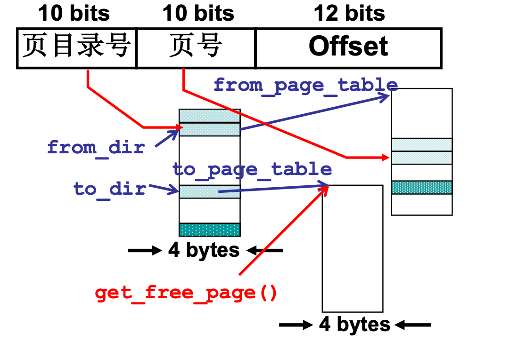 

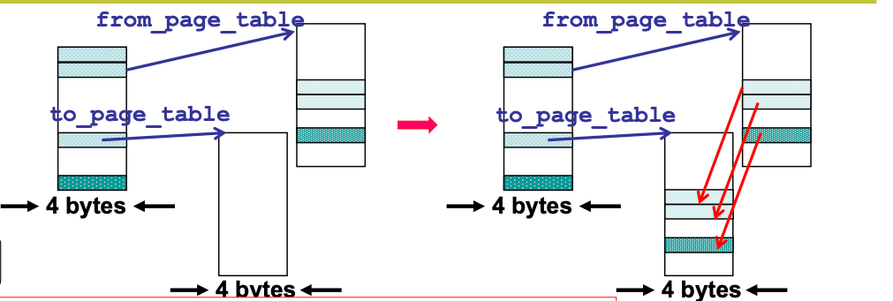 

#### 5.2.3 get_free_page分析

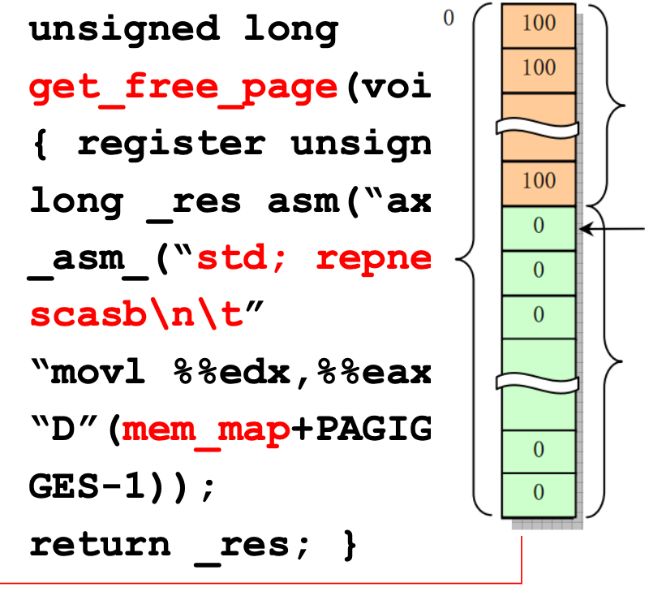 

主要是找到一块空闲的内存页，然后返回。

#### 5.2.4 代码片段分析

##### 4.2.4.1 片段一

```c
if ((from&0x3fffff) || (to&0x3fffff))
		panic("copy_page_tables called with wrong alignment");
```

确保源地址和目标地址在低22位（0x3fffff）上为零，这通常是 x86 架构中对物理地址进行对齐的要求。如果源地址或目标地址的低22位不是零，就会调用 panic 函数，该函数用于处理严重的错误情况。

##### 5.2.4.2 片段二

```c
from_dir = (unsigned long *) ((from>>20) & 0xffc); /* _pg_dir = 0 */
to_dir = (unsigned long *) ((to>>20) & 0xffc);
size = ((unsigned) (size+0x3fffff)) >> 22;
```

 

##### 5.2.4.3 片段三

```c
for( ; size-->0 ; from_dir++,to_dir++) {
		if (1 & *to_dir)
			panic("copy_page_tables: already exist");
		if (!(1 & *from_dir))
			continue;
```

在得到了源起始目录项指针from_dir和目的起始目录项指针to_dir以及需要复制的页表个数size后，下面开始对每个页目录项依次申请1页内存来保存对应的页表，并且开始页表项复制操作。

+ 如果目的目录项指定的页表已经存在（P = 1），则出错死机；
+ 如果源目录项无效，则指定的页表不存在（P=0），则继续处理下一个页目录项；

##### 5.2.4.4 片段四

```c
from_page_table = (unsigned long *) (0xfffff000 & *from_dir);
if (!(to_page_table = (unsigned long *) get_free_page()))
  return -1;	/* Out of memory, see freeing */
```

在验证了当前源目录项和目的项正常之后，我们取源目录项中页表地址from_page_table。为了保存目的目录项对应的页表，需要在主内存区中申请一页空闲内存页。如果取空闲页面函数get_free_page返回0，则说明没有申请到空闲内存页面，可能是内存不够，于是返回-1并退出。

##### 5.2.4.5 片段五

```c
*to_dir = ((unsigned long) to_page_table) | 7;
nr = (from==0)?0xA0:1024;
```

否则我们设置目的目录项信息，把最后3位置位，表示对应页表映射的内存页面是用户级别的，并且可读写，存在。

+ 如果U/S=0，则R/W就没有作用；
+ 如果U/S=1，而R/W=0，则运行在用户层的代码就只能读页面；
+ 如果U/S=1 R/W=1，则就有读写的权限；

然后针对当前处理的页目录项对应的页表，设置需要复制的页面项数。

+ 如果是在内核空间，则仅需要复制头160页对应的页表项的页表，对应于开始640KB物理内存；
+ 否则需要复制一个页表中所有1024个页表项（nr=1024），可映射4MB物理内存；

##### 5.2.4.6 片段六

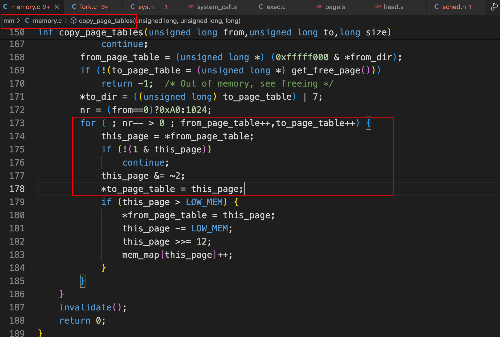 

对应于当前页表，开始循环复制指定的nr个内存页面表项。先取出源页表项内容。

+ 如果当前源页面没有使用，则不用复制该表项，继续处理下一项。
+ 否则复位页表项中R/W标志（位1置0），即让页表项对应的内存页面只读。

然后将该页表项复制到目的页表中。

##### 5.2.4.7 片段七

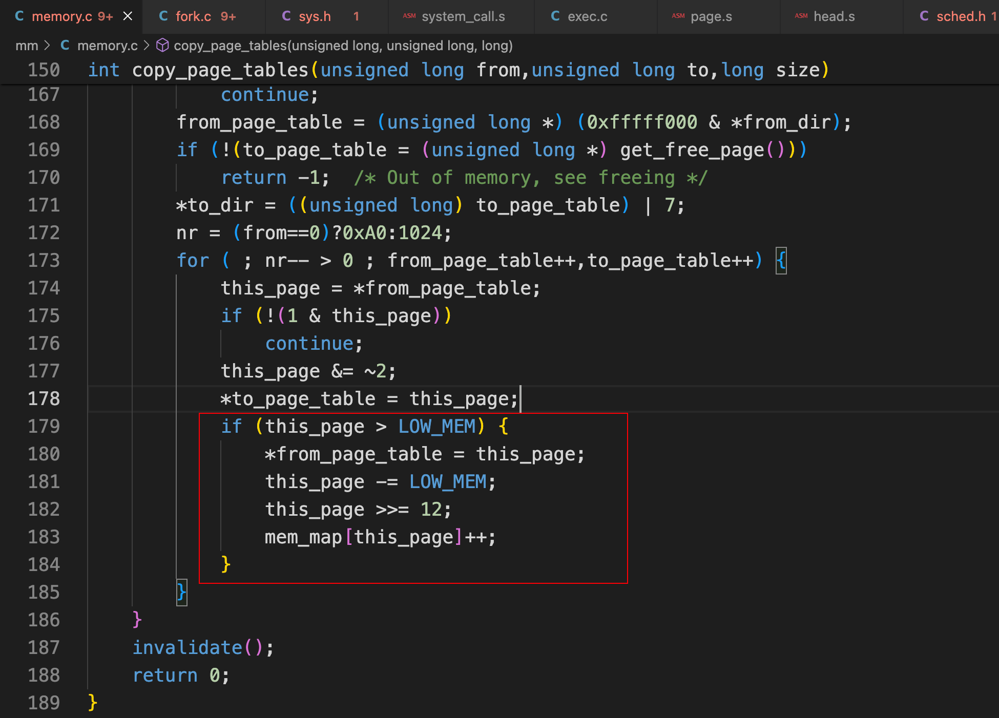 

如果该页表项所指物理页面的地址在1MB以上，则需要设置内存页面映射数组mem_map[]，于是计算页面号，并以它为索引在页面映射数组对应项中增加引用次数。而对于位于1MB以下的页面，说明是内核页面，因此不需要对mem_map[]进行设置。因为mem_map[]仅用于管理主内存区中的页面使用情况。

因此对于内核移动到任务0中并且调用fork创建任务1时（用于运行init()），由于此时复制的页面还仍然都在内核代码区域，因此以下判断语句中的语句不会执行，任务0的页面仍然可以随时读写。只有当调用fork的父进程代码处于主内存区（页面位置大于1MB）时才会执行。这种情况需要在进程调用execve并装载执行了新程序代码时才会出现。

```c
*from_page_table = this_page;
```

这行语义是让源页表项所指内存页也为只读。因为现在开始有两个进程共用内存区了，若其中一个进程需要进行写操作，则可以通过页异常写保护处理为执行写操作的进程分配1页新空闲页面，也即进行写时复制。

## 6. 总结

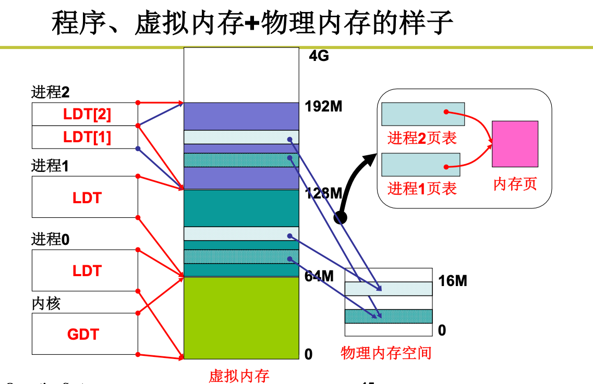 

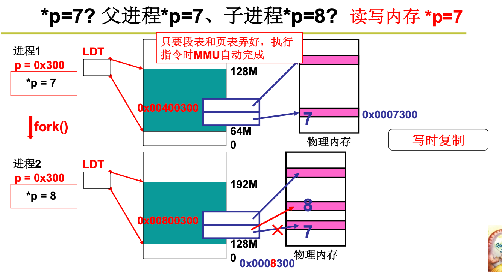 

## 7. 为什么fork一次调用两个返回值？

在进行多进程编程时，调用`fork()`API根据其返回值的不同可以判断是父进程还是子进程，父进程返回子进程的pid，子进程则“返回”0。

至于原因，我们首先知道在`copy_process`中设置子进程PCB中的TSS中的eax的值为0，而在切换到子进程执行时，会将子进程PCB中的TSS的寄存器的值赋值给CPU对应的寄存器，所以子进程开始执行时其eax寄存器的值为0，而eax寄存器是用来保存函数的返回值的。

而`copy_process`会将子进程的pid号即`last_pid`返回到`sys_fork`，而`sys_fork`会返回到中断处理函数`system_call`中。在从`sys_fork`返回到`system_call`之后，`system_call`会首先将保存有`sys_fork`返回值的eax寄存器压栈，然后判断父进程是否需要调度，如果需要调度，则执行`schedule()`调度函数让出CPU。此后可能是子进程也可能是其他进程继而得到CPU的使用权。不论如何父进程经过调度还会再次得到CPU的使用权，那么还会从原来在`system_call`中被换出的地方继续执行，和父进程从`sys_fork`返回到`system_call`之后不经过调度一直执行到从`system_call`返回用户态的过程，除了有个换出的时间间隔外，执行流程上并没有区别。父进程如果不需要调度再做一些信号处理工作后就会执行`iret`指令返回到用户态，返回到用户态时eax寄存器保存的正是子进程的pid。

回顾下`fork()API刚进入内核时进程0的内核栈的样子`，也正是父进程执行`iret`指令时内核栈的样子.

所以父进程从内核返回到用户态后紧接着执行的指令，正是此时内核栈`cs:eip`指向`int $0x80`指令紧接着的下一条指令，该指令会将`sys_fork`保存在eax寄存器的返回值写入到`fork()`API的返回值`__res`变量中。

而`copy_process`在为子进程设置`cs:eip`的值时是复制的父进程刚进入内核时由CPU的保护机制自动压入到父进程内核栈的`cs:eip`的值，也就是父进程返回到用户态后紧接着执行的指令的地址，所以子进程开始执行时就是处于用户态的，且执行的第一条指令也是将其eax寄存器的值赋值给`fork()`API的返回值`__res`。

 

**因为父进程从`fork()`API返回，而子进程是从`fork()`API将要返回的地方开始执行的，所以看上去就好像`fork()`API返回了两次。实际上，所有的函数都只会返回一次，只不过`fork()`API的父进程返回，子进程从返回处开始执行，给人一种一次调用两次返回的误解**。
