# 基于内核栈切换的进程切换

## 参考资料

+ 实验地址：https://www.lanqiao.cn/courses/115/learning/?id=571&compatibility=false
+ 博主
  + 博主1：
    + https://blog.csdn.net/qq_42518941/article/details/119182097
    + https://blog.csdn.net/qq_42518941/article/details/119145575
  + [博主2](https://blog.csdn.net/leoabcd12/article/details/122268321?ops_request_misc=%257B%2522request%255Fid%2522%253A%2522171115295416800222836403%2522%252C%2522scm%2522%253A%252220140713.130102334..%2522%257D&request_id=171115295416800222836403&biz_id=0&utm_medium=distribute.pc_search_result.none-task-blog-2~all~baidu_landing_v2~default-5-122268321-null-null.142%5Ev99%5Epc_search_result_base3&utm_term=%E5%93%88%E5%B7%A5%E5%A4%A7%E6%93%8D%E4%BD%9C%E7%B3%BB%E7%BB%9F%E6%9D%8E%E6%B2%BB%E5%86%9B%E5%AE%9E%E9%AA%8C&spm=1018.2226.3001.4187)
  + 博主3
    + https://blog.csdn.net/a634238158/article/details/100118927
  + 博主4
    + https://www.cnblogs.com/wanghuizhao/p/16988619.html
+ Github
  + https://foxsen.github.io/archbase/

最完整的，可以成功实现的文章：

+ https://www.cnblogs.com/wanghuizhao/p/16988619.html

## 1. 引入

### 1.1 步骤一：修改kernel/sched.c

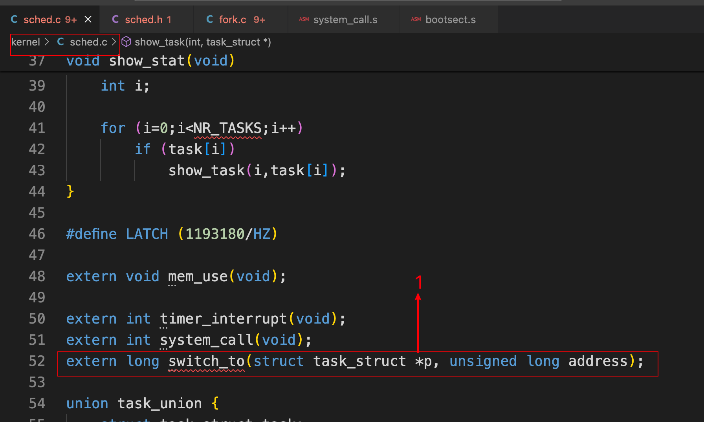 

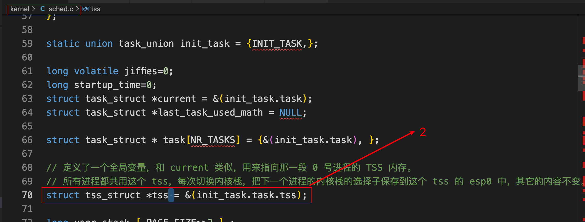 

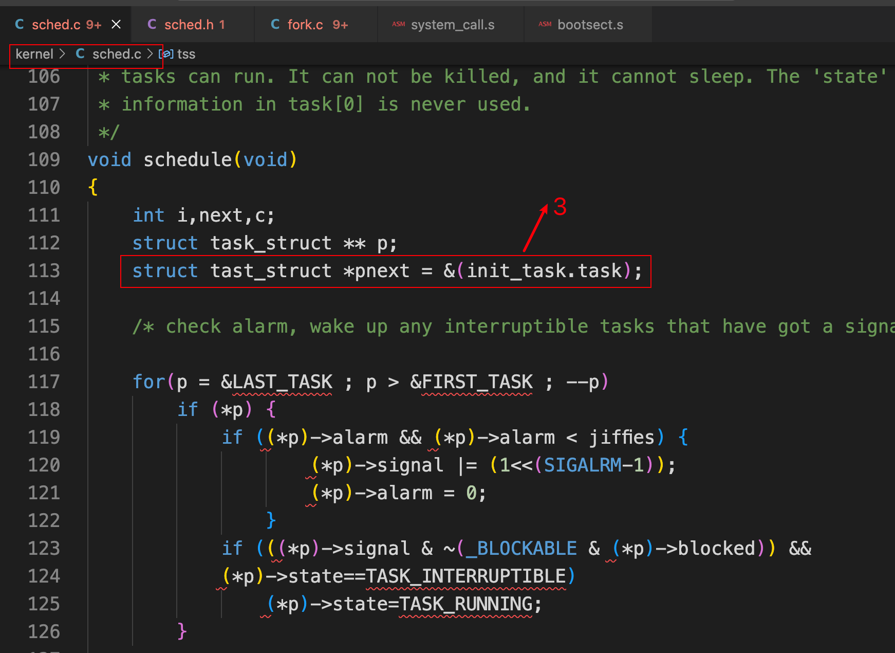 

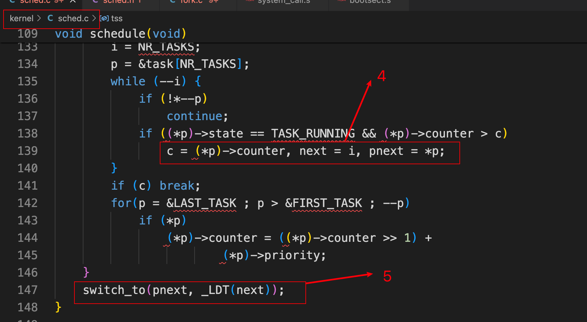 

### 1.2 步骤二：修改include/linux/sched.h

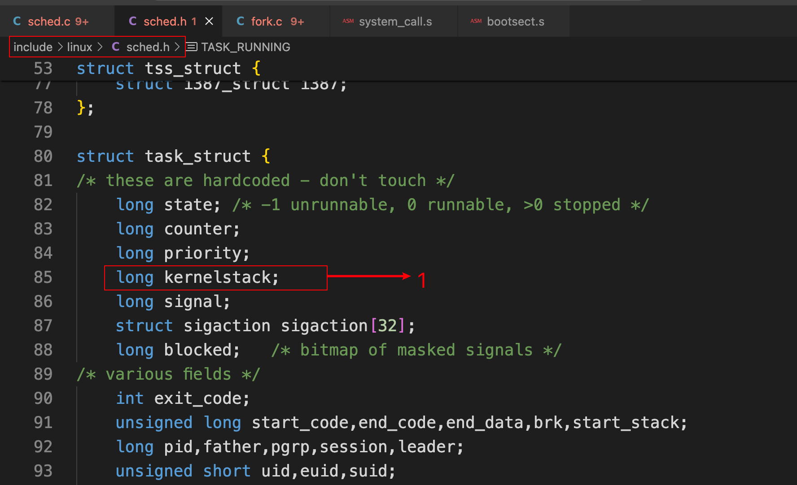 

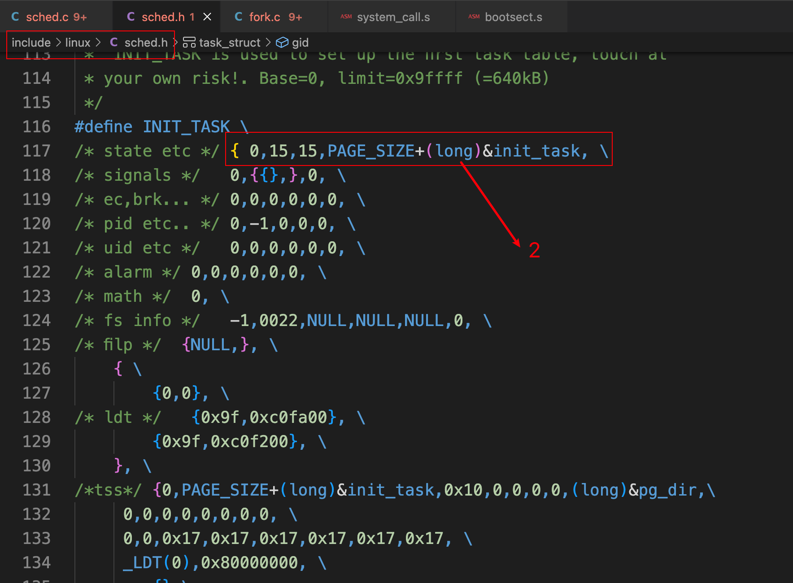 

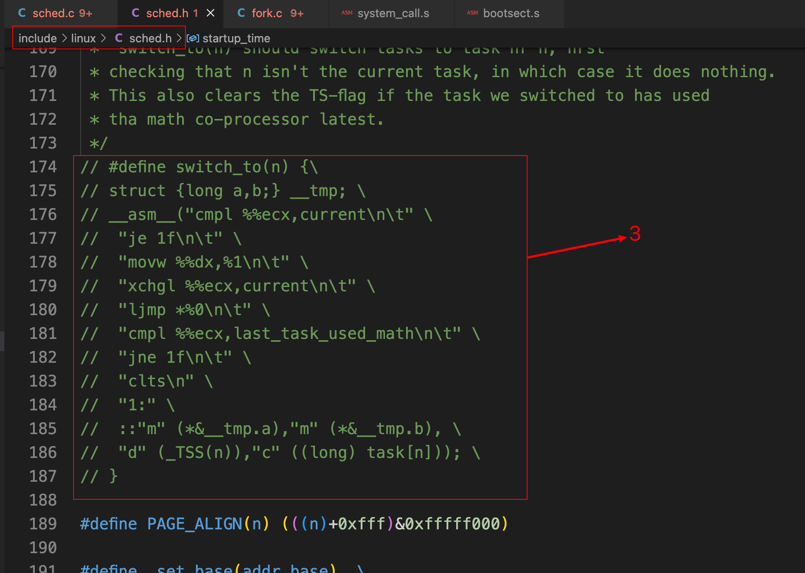 

### 1.3 步骤三：修改kernel/system_call.s

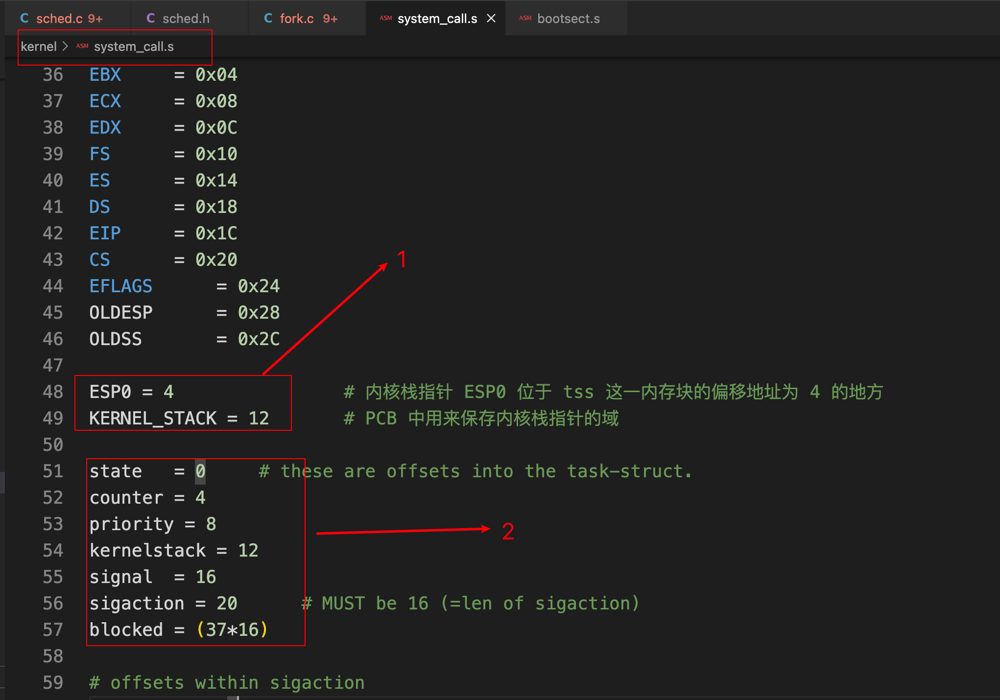 

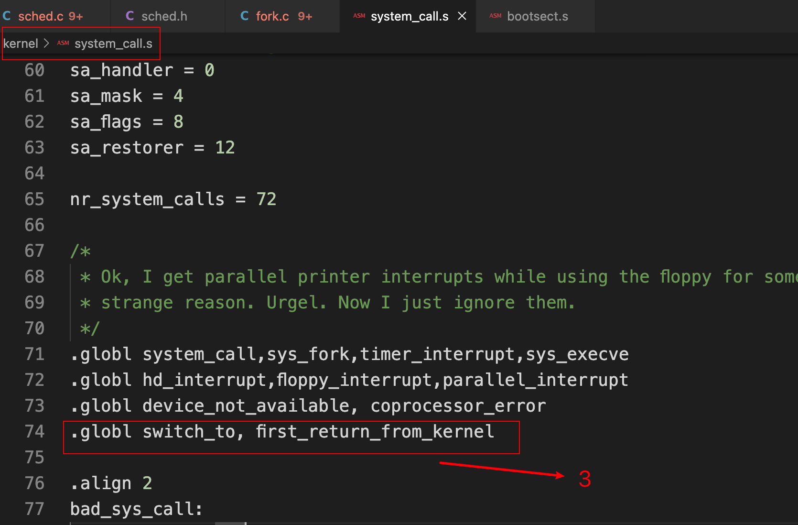 

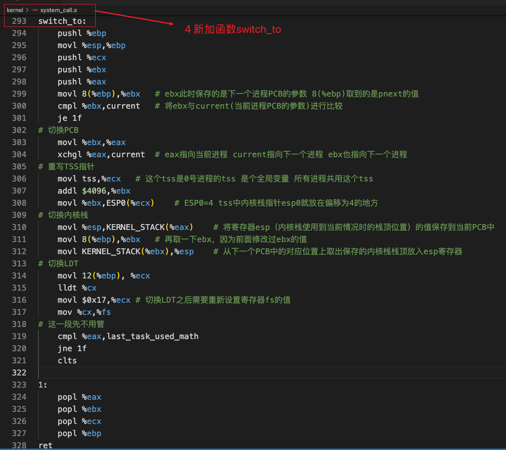   

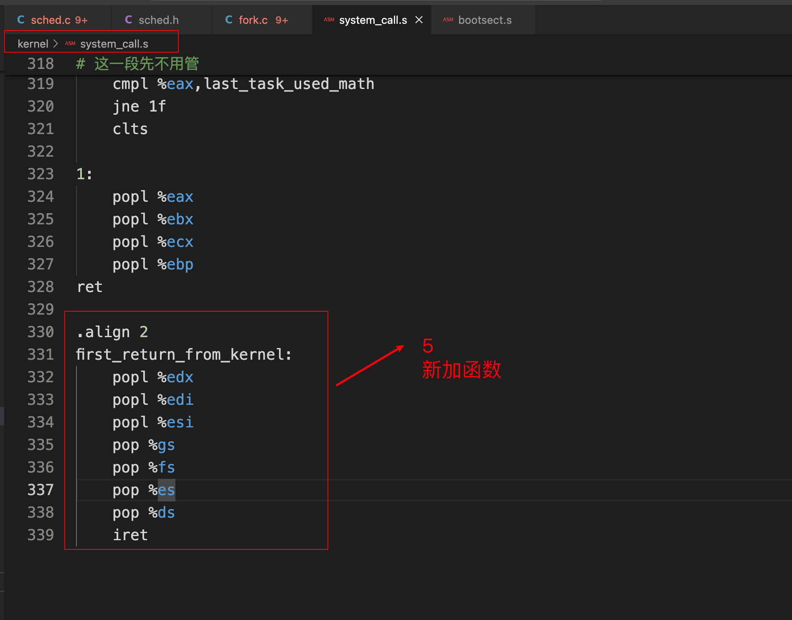 

### 1.4 步骤四：修改kernel/fork.c

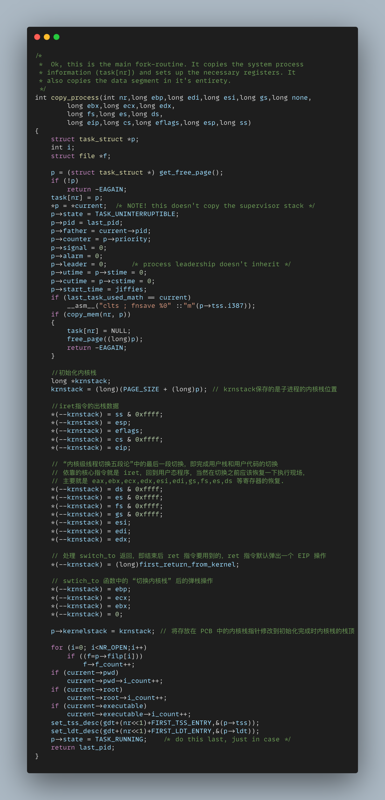 

## 2. 实验四完整代码

https://github.com/niu0217/HGDOS/tree/Lib4

## 3. 课后问题

### 3.1 问题一

针对下面的代码片段：

```assembly
movl tss, %ecx
addl $4096, %ebx
movl %ebx, ESP0(%ecx)
```

回答问题：

- （1）为什么要加 4096；
  4096 字节等于 4KB。由于 Linux 0.11 进程的内核栈和该进程的 PCB 在同一页内存上（一块 4KB 大小的内存），其中 PCB 位于这页内存的低地址，栈位于这页内存的高地址。ebx 指向下一个进程的 PCB，偏移 4KB 之后，便能指向该进程的内核栈地址。
- （2）为什么没有设置 tss 中的 ss0。
  因为 tss.ss0 默认设置为 0x10，已经处于内核态中，而且现在所有的进程都共用一个 tss，因此不需要每次切换都去设置。

### 3.2 问题二

针对代码片段：

```assembly
*(--krnstack) = ebp;
*(--krnstack) = ecx;
*(--krnstack) = ebx;
*(--krnstack) = 0;
```

回答问题：

- （1）子进程第一次执行时，eax=？为什么要等于这个数？哪里的工作让 eax 等于这样一个数？
  eax = 0，目的是为了将父子进程区分开，改写的 copy_process 函数中 *(--krnstack) = 0; ，该代码经过出栈操作后，将 0 赋值给 eax 寄存器，最后经过 iret 指令后，在用户态就能得到调用 fork() 函数的返回值，等于 0 就代表是子进程。（即可以使用这样的代码 if (!fork()) {...}）
- （2）这段代码中的 ebx 和 ecx 来自哪里，是什么含义，为什么要通过这些代码将其写到子进程的内核栈中？
  ebx 和 ecx 来自 copy_process() 函数的参数，这些参数来自调用 copy_proces() 的进程的内核栈中，就是父进程的内核栈中，所以对于 fork() 函数而言，子进程是父进程内核栈数据的拷贝，就是要让父子进程共用同一个代码、数据和堆栈。这样可以保证切换到子进程用户态运行时，子进程和父进程处于同样的环境。
- （3）这段代码中的 ebp 来自哪里，是什么含义，为什么要做这样的设置？可以不设置吗？为什么？
  ebp 来自于父进程，保存的是父进程用户栈基地址指针。即在 fork 刚刚执行完 copy_process 的时候，它的用户栈是父进程的用户栈，而非自己的用户栈。当子进程进行其他操作时，造成需要的栈将要与父进程不同了，才会创建自己的用户栈。这么做的好处时当一些子进程什么都不做，系统不用分配额外的空间。这就是 Copy On Write。

### 3.3 问题三

- 为什么要在切换完 LDT 之后要重新设置 fs=0x17？而且为什么重设操作要出现在切换完 LDT 之后，出现在 LDT 之前又会怎么样？
  为了重新去查 GDT 表，重新取一下段寄存器 fs 的值，是必须要加的，也必须要出现在切换完 LDT 之后，这是因为通过 fs 访问进程的用户态内存，LDT 切换完成就意味着切换了分配给进程的用户态内存地址空间，所以前一个 fs 指向的是上一个进程的用户态内存，而现在需要执行下一个进程的用户态内存，所以就需要重取 fs。
  如果出现在 LDT 之前访问的就还是上一个进程的用户态内存。

## 4. 核心知识点

### 4.1 Linux内核使用描述符表的示意图

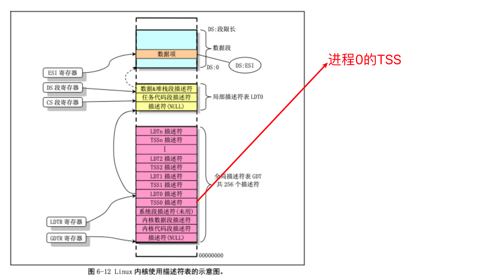 

### 4.2 内核栈内容在进程切换时的变化过程

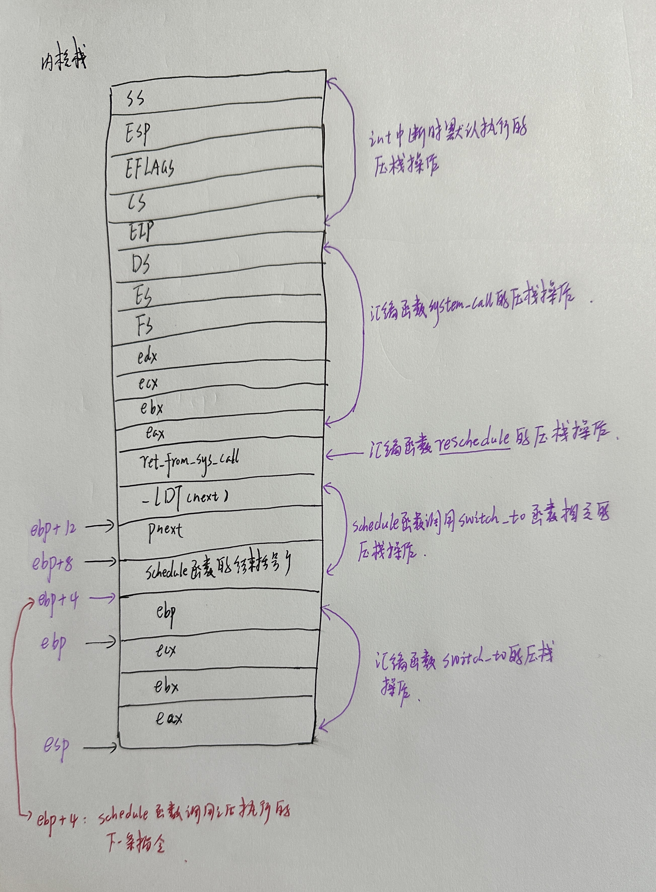 

### 4.3 fork进程的父子进程结构

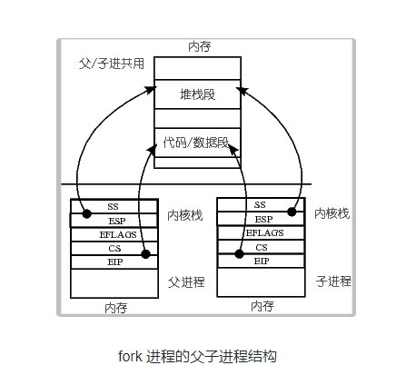 

