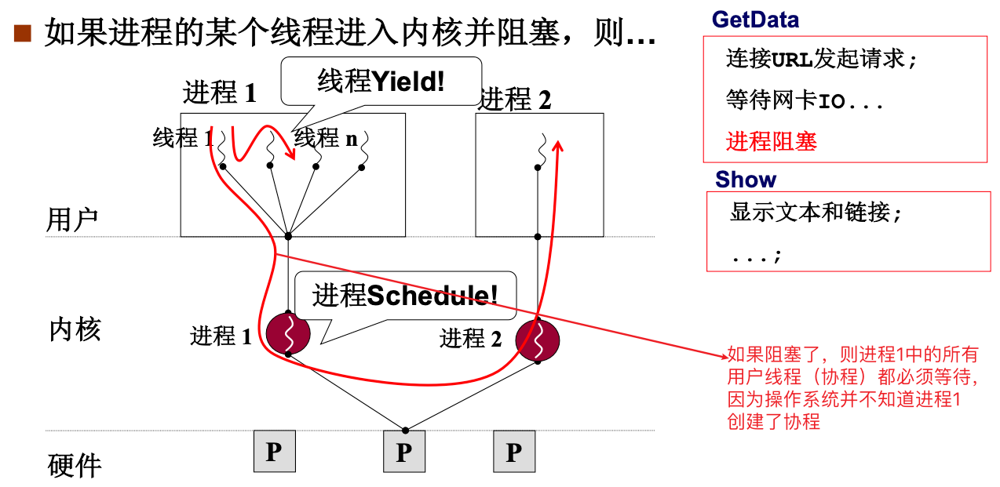
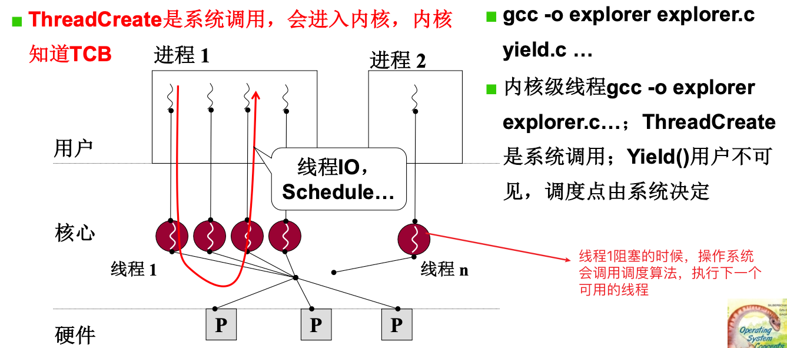
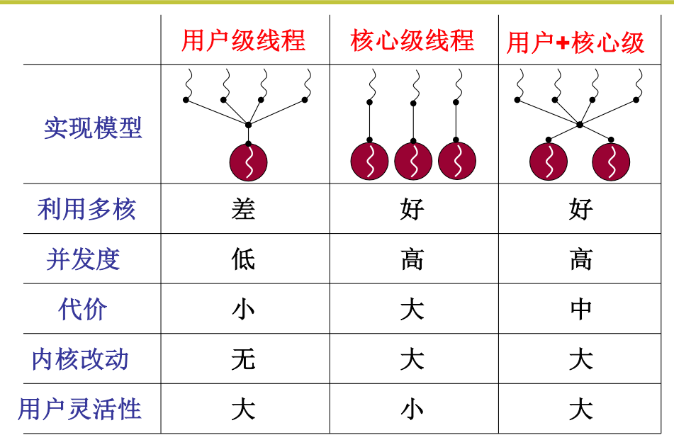
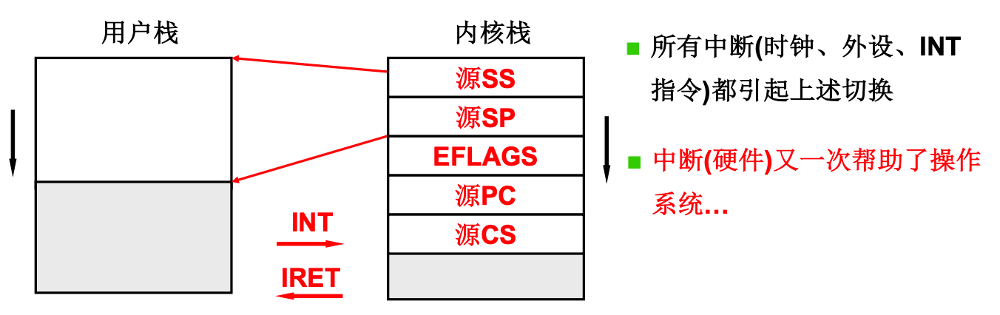
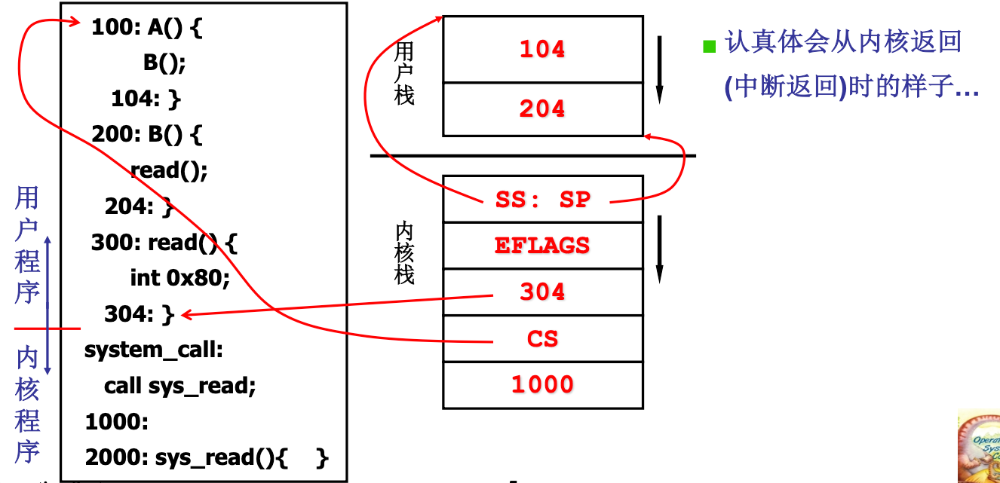
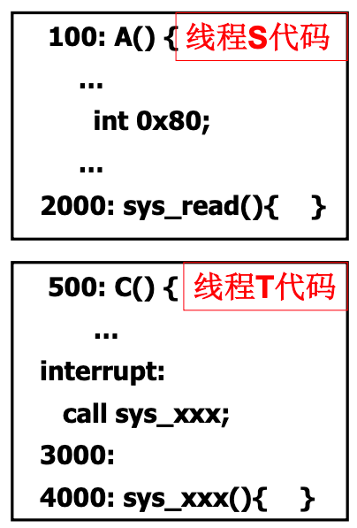
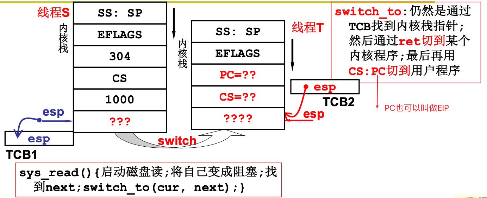
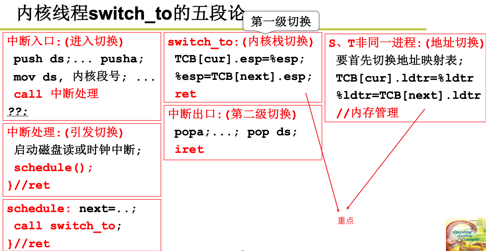
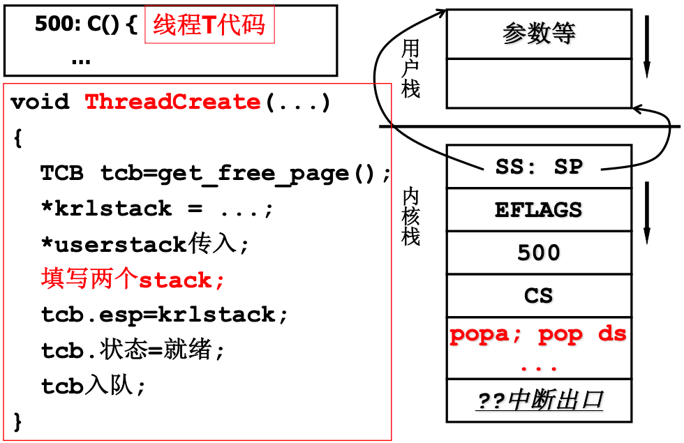

# 用户级线程和核心级线程

## 参考网址

非常NB：

+ [操作系统学习笔记——用户级线程和核心级线程](https://blog.csdn.net/qq_42518941/article/details/119145575)

## 1. 用户级和核心级线程

### 1.1 用户级线程

 

### 1.2 核心级线程

 

### 1.3 全面对比

 

## 2. 举例分析核心级线程

### 2.1 用户栈和内核栈关系

 

### 2.2 起点 

 

### 2.3 开始内核中的切换：switch_to

 

 

### 2.4 内核线程switch_to的五段论

 

### 2.5 ThreadCreate的样子

 

 