# 进程信号

## 1. kernel/signal.c

### 1.1 sys_sgetmask

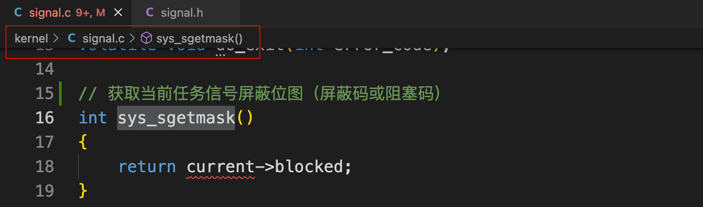 

### 1.2 sys_ssetmask

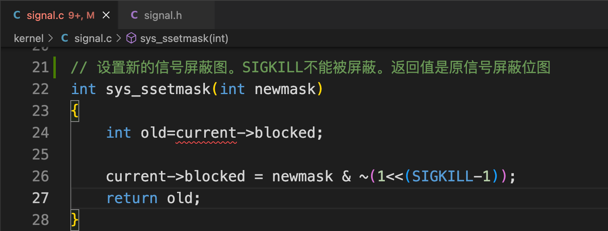 

### 1.3 save_old

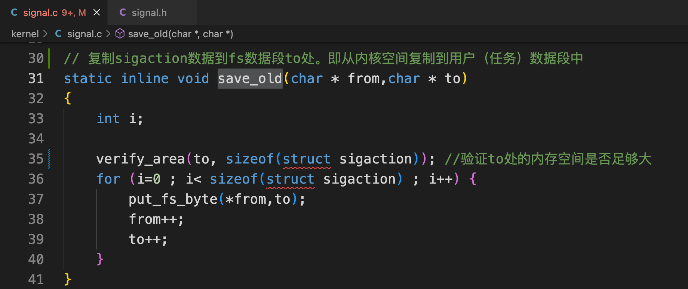 

### 1.4 get_new

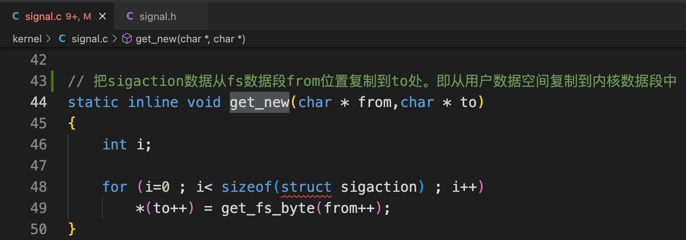 

### 1.5 sys_signal

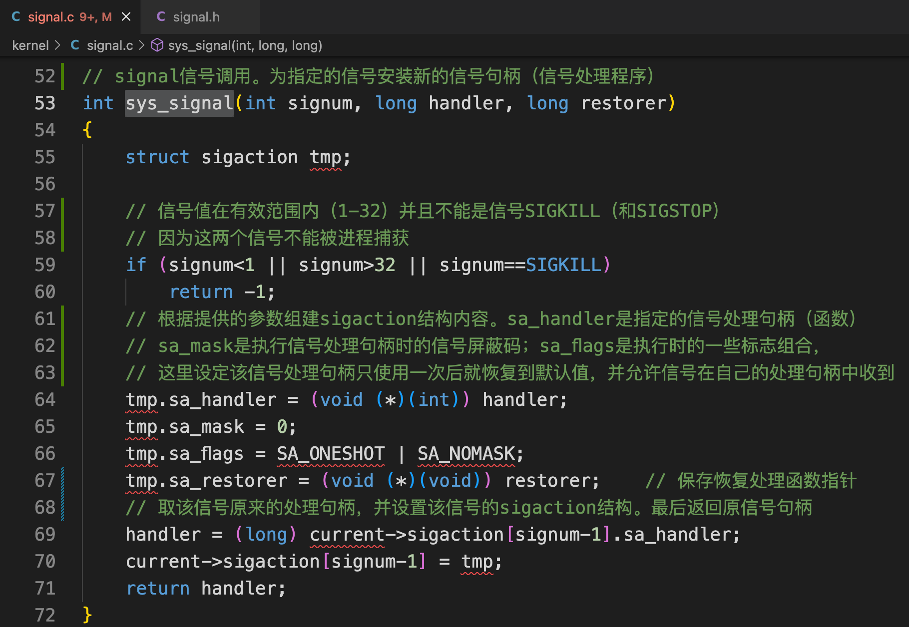 

### 1.6 sys_sigaction

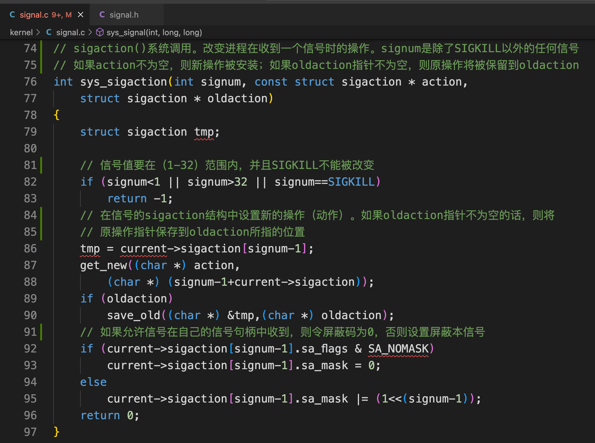 

### 1.7 do_signal

#### 1.7.1 代码

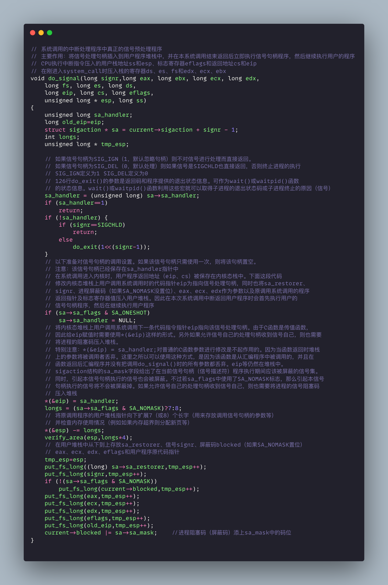 

#### 1.7.2 图解

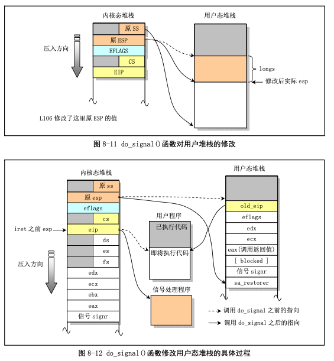 

## 2. 常见的进程信号

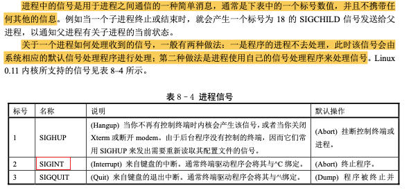 

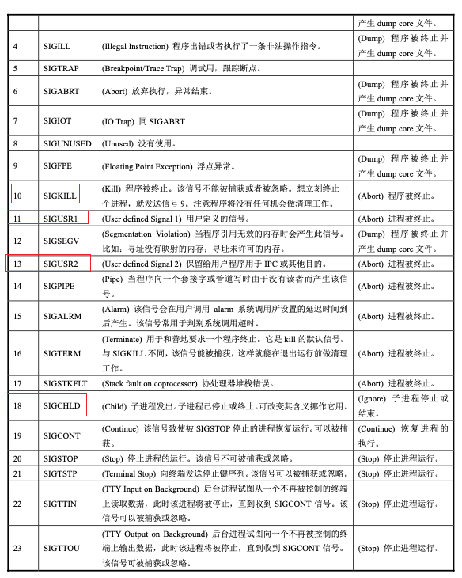 

## 3. 信号处理程序调用方式

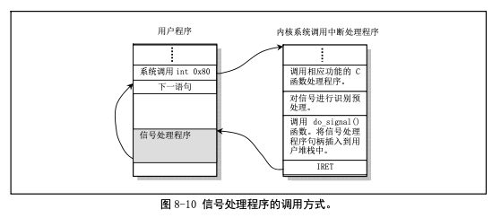 

