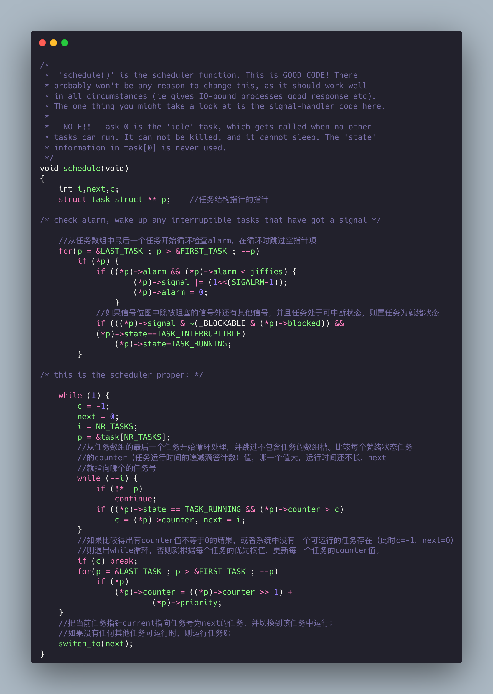

# 进程调度

## 代码地址

+ https://github.com/niu0217/HGDOS/tree/Note

## 1. kernel/sched.c

### 1.1 schedule函数

 

其中switch_to函数的定义：

 

### 1.2 sys_pause函数

 

### 1.3 sleep_on函数

#### 1.3.1 我的注释

  

#### 1.3.2 原注释

 

#### 1.3.3 原理图解

 

 

### 1.4 interruptible_sleep_on函数

 

### 1.5 wake_up函数

  

### 1.6 有用的初始化

 

