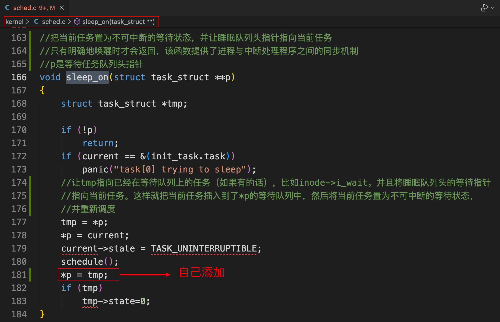

# 进程调度

## 代码地址

+ https://github.com/niu0217/HGDOS/tree/Note

## 1. kernel/sched.c

### 1.1 schedule函数

  

其中switch_to函数的定义：

 

### 1.2 sys_pause函数

 

### 1.3 sleep_on函数

#### 1.3.1 我的注释

  

#### 1.3.2 原注释

 

#### 1.3.3 原理图解

 

 

此时`*p`指向的是等待队列的队首位置。

+ `*tmp`是一个局部变量，所以它存在栈中，哪个栈呢？当前进程的内核栈中；
+ 既然`*tmp`存在于当前进程的内核栈中，那么当前进程当然可以找到`*tmp`；
+ 进程切换的时候，内核栈也会跟着切换。而每个内核栈中都有一个`*tmp`，它指向原等待任务，这不就是一个隐形的链表；

### 1.4 interruptible_sleep_on函数

 

### 1.5 wake_up函数

  

### 1.6 有用的初始化

 

## 2. 进程状态变化图

[来源地址](https://github.com/Wangzhike/HIT-Linux-0.11/blob/master/3-processTrack/3-processTrack.md#1-%E8%BF%9B%E7%A8%8B%E7%8A%B6%E6%80%81%E7%9A%84%E5%88%87%E6%8D%A2)

Linux 0.11将进程的状态分为5类：

```bash
#define TASK_RUNNING		0
#define TASK_INTERRUPTIBLE	1
#define TASK_UNINTERRUPTIBLE	2
#define TASK_ZOMBIE		3
#define TASK_STOPPED		4
```

 

进程的状态切换一定是由内核程序完成的，所以一定发生在内核态。

## 3. 分析所有发生调度的地方

### 3.1 fork新建进程

我们已经知道`fork()`API最后对应的内核实现函数为`sys_fork`，而`sys_fork`的核心为函数`copy_process`，其负责完成进程的创建。`copy_process`就进程状态的切换来说比较简单：

+ 先为新建进程申请一页内存存放其PCB，将子进程的状态先设置为不可中断睡眠(TASK_UNINTERRUPTIBLE)；
+ 开始为子进程复制并修改父进程的PCB数据。完成后将子进程的状态设置为就绪态(TASK_RUNNING)。

这个过程对应了进程新建(N)和就绪(J)两种状态。

 

### 3.2 schedule调度函数

+ `schedule()`首先对所有任务(不包括进程0)进行检测，唤醒任何一个已经得到信号的进程(调用sys_waitpid等待子进程结束的父进程，在子进程退出后，会在此处被唤醒)，所以这里需要记录进程变为就绪(J)。
  + `调用sys_waitpid等待子进程结束的父进程，在子进程退出后，会在此处被唤醒`。这句话的意思是父进程因为等待子进程退出，而一直处于阻塞状态，此时如果收到子进程退出信号SIGCHLD，那么父进程等到它想要的结果，就可以从阻塞状态变为就绪状态了。

+ 接下来开始选择下一个要运行的进程。首先从末尾开始逆序检查`task`数组中的所有任务(不包括进程0)，在就绪状态的任务中选取剩余时间片(`counter`值)最大的任务。这里有两种特殊情况：
  + 如果有就绪状态的任务但它们的时间片都为0，就根据任务的优先级(`priority`值)重新设置所有任务(包括睡眠的任务)的时间片值`counter`，再重新从`task`数组末尾开始选出时间片最大的就绪态进程；
  + 或者当前没有就绪状态的进程，那么就默认选择进程0作为下一个要运行的进程。

+ 最后，选出了接下来要运行的进程，其在`task`数组中的下标为`next`，调用`switch_to(next)`进行进程切换。

  这里需要记录：

  + next进程变为运行(R)；

  + 以及可能的当前运行态的进程变为就绪(J)；

  + 当然也可能选出的`next`仍然是当前进程，那么就不需要进行进程切换。

### 3.3 sys_pause主动睡觉

当系统无事可做时(当前没有可以运行的进程)时就会调度进程0执行，所以`schedule`调度算法不会在意进程0的状态是不是就绪态(TASK_RUNNING)，进程0可以直接从睡眠切换到运行。而进程0会马上调用`pause()`API主动睡觉，在最终的内核实现函数`sys_pause`中又再次调用`schedule()`函数。

也就是说，系统在无事可做时会触发这样一个循环：

+ `schedule()`调度进程0执行；
+ 进程0调用`sys_pause()`主动睡觉，从而引发`schedule()`再次执行；
+ 接下来进程0又再次执行，循环往复，直到系统中有其他进程可以执行；

而这个循环每执行一次的时间很短，所以在系统无事可做时，这个过程将十分频繁地重复。

 

### 3.4 不可中断睡眠sleep_on

`sleep_on()`算是内核中比较晦涩难懂的函数了，因为它利用几个进程因等待同一资源而让出CPU都陷入`sleep_on()`函数的其各自内核栈上的`tmp`指针，将这些进程隐式地链接起来形成一个等待队列。
`sleep_on()`的参数`p`是进程结构体`task_struct`的指针的指针，在调用时通常传入的是特定的`task_strcut *`类型的变量的地址，如文件系统内存i节点的`i_wait`指针，内存缓冲操作中的`buffer_wait`指针等。`tmp`是存储在对应进程内核堆栈上的函数局部变量。下面我们通过分析一个具体的三个进程(pid)：5,6,7为等待内存缓冲区而依次调用`sleep_on()`的例子，分析下等待队列的形成过程：

+ 进程5调用`sleep_on(&buffer_wait)`，初始时`buffer_wait`的值为NULL，所以：

  ```c
  tmp = NULL(*p);
  buffer_wait(*p)= task[5](current);
  ```

  接着调用`schedule()`函数让出CPU切换到进程6执行，而进程5运行停留在`sleep_on`函数中。

 

也就是进程5阻塞在上图中的红色方框。

+ 进程6调用`sleep_on(&buffer_wait)`，此时`buffer_wait`的值为`task[5]`，所以：

  ```c
  tmp = task[5](*p);
  buffer_wait(*p) = task[6](current);
  ```

  接着调用`schedule()`函数让出CPU切换到进程7执行，而进程6运行停留在`sleep_on`函数中。

+ 进程7调用`sleep_on(&buffer_wait)`，此时`buffer_wait`的值为`task[6]`，所以：

  ```c
  tmp = task[6](*p);
  buffer_wait(*p) = task[7](current);
  ```

  接着调用`schedule()`函数让出CPU切换到其他进程执行，而进程7运行同样停留在`sleep_on`函数中。

最终的内存中各个进程内核堆栈以及`buffer_wait`变量的内容如下：

 

对于不可中断睡眠(TASK_UNINTERRUPTIBLE)只能由`wake_up()`函数显式地从这个隐式的等待队列头部唤醒队列头进程，再由这个队列头部进程执行`schedule()`函数后面的`if (tmp) tmp->state=0;`通过由`tmp`变量链接起来的等待队列依次唤醒等待的进程。

### 3.5 可中断睡眠interruptible_sleep_on

可中断睡眠与不可中断睡眠相比，除了可以用`wake_up`唤醒外，也可以用信号(给进程发送一个信号，实际上就是将进程PCB中维护的一个向量的某一位置位，进程需要在合适的时候处理这一位。)来唤醒，比如在`schedule()`中一上来就唤醒得到信号的进程。

这样的唤醒会出现一个问题，那就是可能会唤醒等待队列中间的某个进程，此时就需要对和`sleep_on`中形成机制一样的等待队列进行适当调整：

+ 从`schedule()`调用唤醒的当前进程如果不是等待队列头进程，则将队列头唤醒，并通过`goto repeat`让自己再去睡眠。
+ 后续和`sleep_on`一样，从队列头进程这里利用`tmp`变量的链接作用将后续的进程唤醒。由于队列头进程唤醒后，只要依靠`tmp`变量就可以唤醒后续进程，所以已经不再需要使用队列头指针`*p`，将其值设置为NULL，从而为再次将其作为`interruptible_sleep_on`函数的参数做准备(因为`wake_up`已经做了同样的处理，这里似乎没有必要？)。

### 3.6 显式唤醒wake_up

`wake_up`的作用就是显式唤醒队列头进程，所以这里需要记录进程唤醒(J)。唤醒队列头之后，`sleep_on`和`interruptible_sleep_on`会将队列的后续进程依次唤醒，所以不再需要该等待队列的头指针`*p`，将其置为NULL，为后续再次将其作为`sleep_on`和`interruptible_sleep_on`函数参数做好初始化。

 

### 3.7 进程退出do_exit

`do_exit`将进程的状态设为僵尸态(TASK_ZOMBIE)，所以这里需要记录进程的退出(E)。子进程终止时，它与父进程之间的关联还会保持，直到父进程也正常终止或父进程调用`wait`才告结束。因此，进程表中代表子进程的表项不会立即释放。虽然子进程已经不再运行，但它仍然存在于系统中，因为它的退出码还需要保存起来，以备父进程今后的`wait`调用使用。 

### 3.8 父进程等待子进程退出sys_waitpid

### 3.9 有意思的结论

#### 3.9.1 sys_waitpid调用是子进程先退出父进程才醒来

 

上图解释：

+ 1185
  + 4号进程从运行变为了阻塞，等待子进程6退出；
  + 子进程6开始运行；
+ 1191
  + 6号进程结束；
  + 4号进程重新调度变为就绪；
  + 4号进程运行；

  

上图解释：

+ 基础概念：
  + 8号进程是一个父进程；
  + 9，10，11，12号进程都是8号进程创建出来的子进程；
+ 8099
  + 8号进程阻塞等待子进程退出；
  + 9号进行运行；
+ 8159
  + 9号进程退出；
  + 8号进程变为就绪；
  + 8号进程变为运行；

#### 3.9.2 sleep_on调用是要退出的进程先wake_up显式唤醒睡眠进程才退出

 

## 4. 进程完整调度流程

 


