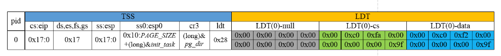
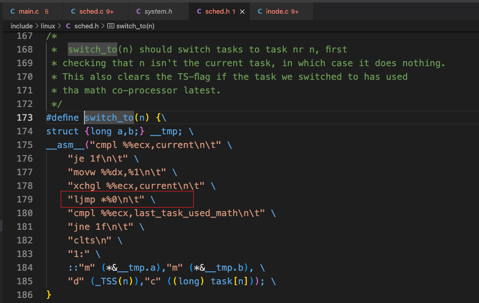
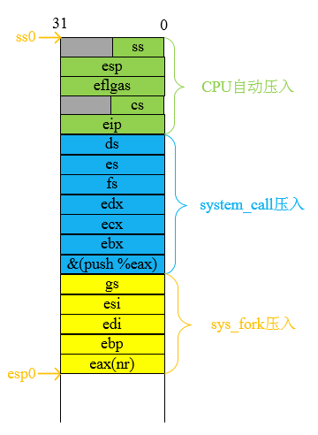

# 进程运行轨迹

## [参考地址](https://github.com/Wangzhike/HIT-Linux-0.11/blob/master/3-processTrack/3-processTrack.md#1-%E8%BF%9B%E7%A8%8B%E7%8A%B6%E6%80%81%E7%9A%84%E5%88%87%E6%8D%A2)

## 1. 基本概念

### 1.1 进程的大致状态

- N 进程新建
- J 进入就绪态
- R 进入运行态
- W 进入阻塞态
- E 退出

### 1.2 Linux内核使用描述符的示意图

 

### 1.3 task_struct

 

### 1.4 硬件上下文（TSS）和LDT

硬件上下文是进程开始执行(被创建后第一次执行)或恢复执行(退出CPU使用权后再次被调度执行)前必须装入CPU寄存器的一组数据：

+ 和进程代码段有关的寄存器`cs和eip`；
+ 和进程数据段有关的寄存器`ds,es,fs,gs,esi,edi`；
+ 和进程用户态堆栈有关的寄存器`ss和esp`以及内核态堆栈有关的`ss0和esp0`；
+ 和页目录表基地址有关的寄存器`cr3`；
+ 以及GDT中的进程的局部描述符表LDT的描述符的段选择符`ldt`；
+ 以及`eax,ebx,ecx,edx`这些通用寄存器等描述CPU状态的重要寄存器的值。

## 2. init/main.c

 

`init/main.c`中的main函数是`boot/head.s`执行完后接着执行的代码。

+ main函数首先统计物理内存的容量，并对物理内存进行功能划分。
+ 然后进行所有方面的硬件初始化工作，包括陷阱门，块设备，字符设备和tty。
+ 人工设置任务0(进程0)的PCB以及其在GDT表中的任务状态段描述符tss0和局部描述符表描述符ldt0，然后通过模拟从特权级变化的内核中断处理过程的返回机制，手动切换到任务0中。
+ 在任务0中通过`fork()`系统调用创建出子进程任务1(进程1：init进程)，由init进程进行进一步的处理工作。而任务0不会退出，它会在系统没有进程运行的空闲状态被调度执行，而任务0也只是调用`puase()`系统调用主动休眠，再次引发系统调度，以检查当前是否有其他进程需要调度。

### 2.1 物理内存的功能划分

+ `memory_end`变量记录了以字节为单位的物理内存的容量，并且是页大小(4KB)的整数倍。

+ `buffer_memory_end`记录了高速缓冲区的尾端地址，其中包括了用于显存和设备以及ROM BIOS的物理内存。
+ `main_memory_start`记录了主内存区的起始地址，一般来说，`main_memory_start`等于`buffer_memory_end`。如果系统包含虚拟盘，则`main_memory_start`的起始地址相对于`buffer_memory_end`的地址要后移，从而为虚拟盘留出内存空间。 由此可知，系统的物理内存被划分为内核模块，高速缓冲区，虚拟盘，主内存区四大部分。以拥有16MB的物理内存的系统为例，下图展示了其物理内存的功能划分：

 

 

`mem_map`数组是全局的，用于对系统扩展内存(大于1MB的物理内存)的使用情况以页为单位进行统计。在系统在进行内存初始化时就将1MB~4MB的高速缓冲区以及虚拟盘(如果存在)设置为已用状态，所以内存管理模块是对主内存区进行分配管理的。

 

  

### 2.2 任务0的内存布局

 

 

 

#### 2.2.1 操作系统内核堆栈与任务0的内核态堆栈

从上图可以看出，任务0的内核态堆栈的选择符是0x10，正是GDT表中内核数据段的选择符，内核态堆栈的栈顶指针设置在其PCB结构体首地址的4KB偏移处，所以任务0的内核态堆栈和操作系统内核的内核态堆栈是不同的。在boot/head.s的开始执行时便通过`lss stack_start, %esp`设置了操作系统内核程序使用的堆栈，其中`stack_start`的定义如下：

 

`lss`指令将0x10赋值给ss，将`user_task`数组的末尾元素的地址，也就是距离`user_stack`数组地址的*4KB*偏移处的地址赋值给esp，所以操作系统内核使用的堆栈的栈顶指针在user_stack数组地址的4KB偏移处，与任务0的内核态堆栈的栈顶地址是不同的。

#### 2.2.2 任务0的线性地址

Linux 0.11的内核以及所有任务的代码段和数据段都是完全重叠的。

#### 2.2.3 设置任务0在GDT表中的TSS描述符和LDT描述符

任务0的PCB是预先设置好的，保存在变量`init_task.task`中。那么操作系统是如何将`init_task.task`与任务0联系起来的？

**每个任务在GDT表中占有两个描述符选项：任务状态段TSS的描述符tss和局部描述符表LDT的描述符ldt**。

+ 任务状态段TSS的描述符tss含有该任务的进程控制块中的任务状态段TSS的基地址，段限长，属性等信息；
+ 局部描述符表LDT的描述符ldt含有该任务的进程控制块中的局部描述符表LDT的基地址，段限长，属性等信息。

需要做的就是将任务0的PCB即`init_task.task`中的TSS和LDT的基地址，段限长和属性信息填入到GDT表中对应的用来存放任务0的TSS描述符和LDT描述符的描述符表项中。这个工作是在`sched_init()`函数中完成的，通过执行`set_tss_desc(gdt+FIRST_TSS_ENTRY,&(init_task.task.tss))`宏函数来设置GDT表中任务0的TSS描述符表项，通过执行`set_ldt_desc(gdt+FIRST_LDT_ENTRY,&(init_task.task.ldt))`宏函数来设置GDT表中的任务0的LDT描述符表项。此时，GDT表的字节分布如下图所示：

 

 

 

 

 

### 2.3 多任务切换

系统在运行多个任务时，是通过调用`switch_to`宏进行任务切换的，`switch_to`进行任务切换的核心代码是**通过`ljmp`指令跳转到新任务的TSS描述符的选择符**来实现的，这会造成CPU自动保存原来任务的硬件上下文到原任务的TSS结构体中，装入新任务的TSS结构体中对应寄存器的内容来切换到新任务的上下文环境中。

 

### 2.4 move_to_user_mode的处理过程

main函数在完成硬件的初始化工作之后来切换到用户态的任务0中执行的机制，并不是使用上面提到的`ljmp`的任务切换机制，这是因为在完成初始化工作之后，系统还是运行在内核态的内核程序，当前系统中还不存在可用的用户态的任务，所以无法利用上面提到的任务切换机制切换到任务0中执行。

CPU的保护机制允许低级别(如特权级为3的用户态)代码通过陷阱门，中断门进入高特权级(如内核)代码中执行，但反之不行。

我们已经知道可以通过`int $0x80`编程异常(Linux系统使用陷阱门处理异常)从用户态进入到内核态执行指定的系统调用，在系统调用执行完毕后通过中断返回指令再从内核态返回到用户态中继续执行。参照这个思想，我们在内核中可以利用模拟中断返回的过程，实现从内核态切换到用户态。

**利用模拟中断返回过程实现从内核态切换到用户态的关键是要将此时内核栈的样子设置的和`int $0x80`编程异常处理完毕后来执行`iret`返回指令前的内核堆栈的样子一样**。

由于`int $0x80`编程异常可以使用户态程序进入内核，所以涉及到用户栈到内核栈的切换，栈的切换是CPU自动完成的。在执行完系统调用后利用`iret`指令返回到用户态，其中`iret`指令的处理过程是将此时保存在栈顶的`eip`,`cs`寄存器的值赋值给CPU的`eip`和`cs`寄存器，这就使得返回到用户态后CPU可以继续执行`int $0x80`紧接着的下一条指令，同时将栈中接着保存的`eflags`,`esp`,`ss`寄存器的内容出栈赋值给CPU对应的寄存器，这就使得用户程序又顺利切换回使用原来的用户栈。

所以要模拟这种特权级发生变化的内核中断返回过程的方式切换到任务0执行，就是按照`ss`,`esp`,`eflags`,`cs`,`eip`的顺序将这5个和任务0有关的寄存器的值压栈，接着和内核中断处理过程返回一样，直接执行`iret`指令就可以切换到用户态的任务0中执行了。

下面是实现模拟中断返回方式切换到任务0的宏函数`move_to_user_mode`：

 

其中0x17是进程0的局部描述符表中数据段的选择符；

0x0f是进程0的局部描述符表中代码段的选择符；

由于进程0的LDT的代码段选择符是0x0f，其CPL的值是3，而在执行`iret`指令时处于内核程序中，此时的特权级是0，所以确实是特权级要发生变化，从而会引起内核栈到用户栈的堆栈切换。

而从任务0的线性地址我们已经知道，进程0的LDT中的代码段和数据段的线性地址的范围是`0x00000000~0x000A0000`，占据了线性地址空间开始处640KB的地址空间。这和内核代码段和数据段的线性地址的起始地址是一致的，但内核代码段和数据段的长度为16MB。

而从`INIT_TASK主要寄存器的值的表`可以看到进程0的页目录表的基地址是`&pg_dir`，和内核代码段和数据段使用的页目录表的基地址是一致的。

也就是说，进程0和内核的代码段和数据段的线性地址都是从`0x00000000`处开始的，且使用相同的页目录表，所以进程0和内核的代码段和数据段的**物理地址**都是从`0x00000000`开始的，只不过内核代码段和数据段可以寻址的范围是整个16MB的物理内存，而进程0的代码段和数据段可寻址的范围只是物理内存开始处的640KB的空间。

下面是`move_to_user_mode`宏函数在执行`iret`指令时模拟的特权级发生变化的中断返回过程的堆栈结构示意图：

 

在执行`iret`指令时**内核堆栈中的`ss:esp`的值就是当前内核堆栈的段选择符以及栈顶指针**，而堆栈中`cs:eip`的值经过段式寻址和页式寻址后最终指向的是内核中`move_to_user_mode`中的标号`1`的位置，堆栈中`eflags`的值是内核的`eflags`寄存器的值，所以**最终进程0开始执行时的主要寄存器的内容相比于`INIT_TASK`宏变量中的内容有所不同**，下图是进程0开始执行时主要寄存器的值：

 

从中可以看出，**进程0的用户态堆栈正是内核的堆栈**。(why????)

## 3. fork实现机制

### 3.1 入口代码

 

### 3.2 分析sys_fork之前

用户态的`fork()`API通过执行`int $0x80`这个编程异常，可以从用户态进入到内核态。

具体来说，**在由用户态进入内核时，CPU的保护机制检测到特权级发生了变化，会自动将用户态程序在执行`int $0x80`时的`ss`,`esp`,`eflags`,`cs`,`eip`这5个寄存器的值顺序压入到进程0的内核栈中**。

`main`函数在执行`iret`指令返回到用户态时的内核堆栈，不含有额外的参数，与`fork()`API触发编程异常进入内核时由CPU自动压入到进程0的内核栈的内容一样，只包含和用户态信息有关的这5个寄存器的值。

同时注意到此时进程0的内核栈中`cs:eip`指向`int $0x80`指令紧接着的下一条指令，该指令的作用是将`fork`系统调用保存在eax中的返回值写入到`fork()`API的返回值`__res`变量中。

在CPU自动将上面提到的5个寄存器的内容压入到进程0的内核栈之后，便开始跳转到`system_call`中断处理函数执行(这是由于`int $0x80`编程异常在IDT表中对应的描述符项的基地址被设置为`system_call`的入口地址)。

 

`system_call`又接着将`ds`,`es`,`fs`这3个寄存器的内容压栈，接着将保存着系统调用参数的`edx`,`ecx`,`ebx`这3个寄存器的内容压栈(尽管`fork()`API没有参数)。然后根据保存在eax寄存器中的系统调用号`__NR_fork`在`sys_call_table`中查找到`fork()`API对应的内核实现函数`sys_fork`，并跳转到`sys_fork`执行。跳转到`sys_fork`执行时进程0内核栈的样子如下图所示：

 

其中`&(push %eax)`是`system_call`调用`sys_fork`返回后紧接着要执行的指令地址。

### 3.3 分析sys_fork

 

#### 3.3.1 find_empty_process

`sys_fork`首先调用`find_empty_process`先为需要新创建的进程分配pid，其实现过程是对全局变量`last_pid`的值不断递增直到找到当前未用的`last_pid`的值。

 

#### 3.3.2 copy_process

`find_empty_process`为新建进程找到pid号和`task`数组中存放新建进程PCB地址的位置后，以该位置下标作为返回值返回。紧接着`sys_fork`将`gs`,`esi`,`edi`,`ebp`以及保存着`find_empty_process`返回值的`eax`寄存器顺序压栈，调用`copy_process`开始为新建进程复制父进程的代码段和数据段以及环境。在调用`copy_process`时进程0内核态堆栈的结构如下图所示：

 

 

对照上面提到的在调用`copy_process`时进程0的内核栈的结构，我们可以看出汇编程序在调用c函数时的参数传递机制：**汇编程序需要逆序将c函数需要的参数压入栈中**，即c函数最后(最右边的)一个参数先入栈，而最左边的第1个参数在最后调用指令`call copy_process`之前入栈。然后执行`call`指令去执行被调用的函数。

另外，**如果c函数的返回值是一个整数或指针，那么寄存器eax将被默认用来传递返回值**。

 

`copy_process`首先申请1页内存用于存放新建进程的PCB数据，并将该页的首地址转换为`task_struct`结构后赋值给`task[nr]`元素，而`nr`就是保存在eax寄存器的`find_empty_process`的返回值，即`find_empty_process`为新建进程在`task`数组找到用于存放其PCB地址的元素的下标。

然后复制父进程的PCB数据到新建的子进程。所以子进程的代码段有关的寄存器`cs:eip`，数据段有关的寄存器`ds`,`es`,`fs`,`gs`,`esi`,`edi`，用户态堆栈有关的寄存器`ss:esp`都和父进程的一样。

当然也不是所有数据简单复制父进程的就可以，还要做必要的修改。

其中：

+ 将子进程的pid设置为`find_empty_process`找到的`last_pid`的值；
+ 将子进程的状态先设置为等待状态，等完成数据复制和修改操作后，再将子进程的状态修改为就绪态，以便可以得到操作系统调度；
+ 将子进程的eax寄存器的值置为0，作为子进程调度后的“类似父进程的从内核中断处理函数`system_call`返回”(实际是从返回处执行，并不是返回)的返回值。
+ 将子进程的内核态堆栈的堆栈栈顶指针设置在该新建页的尾端地址，设置子进程的TSS中的LDT的选择符ldt为子进程自己的值。
+ 调用`copy_mem`为子进程分配线性地址空间地址，指定段限长，以这些值进一步修改子进程PCB中的LDT中的代码段和数据段的基地址和段限长，然后`copy_mem`又调用`copy_page_tables`为子进程分配页表空间复制父进程的页表内容并修改父子进程的页表项的属性为只读，为写时复制(Copy On Write, COW)技术做准备。
+ 最后，`copy_mem`返回到`copy_process`中，设置好新建进程在GDT表中的TSS描述符和LDT描述符后，`copy_process`以新建进程的pid号即`last_pid`作为返回值返回到`sys_fork`中。`sys_fork`拆除`copy_process`的函数栈帧后返回到中断处理函数`system_call`中。

### 3.4 为什么fork一次调用两个返回值？

在进行多进程编程时，调用`fork()`API根据其返回值的不同可以判断是父进程还是子进程，父进程返回子进程的pid，子进程则“返回”0。

至于原因，我们首先知道在`copy_process`中设置子进程PCB中的TSS中的eax的值为0，而在切换到子进程执行时，会将子进程PCB中的TSS的寄存器的值赋值给CPU对应的寄存器，所以子进程开始执行时其eax寄存器的值为0，而eax寄存器是用来保存函数的返回值的。

而`copy_process`会将子进程的pid号即`last_pid`返回到`sys_fork`，而`sys_fork`会返回到中断处理函数`system_call`中。在从`sys_fork`返回到`system_call`之后，`system_call`会首先将保存有`sys_fork`返回值的eax寄存器压栈，然后判断父进程是否需要调度，如果需要调度，则执行`schedule()`调度函数让出CPU。此后可能是子进程也可能是其他进程继而得到CPU的使用权。不论如何父进程经过调度还会再次得到CPU的使用权，那么还会从原来在`system_call`中被换出的地方继续执行，和父进程从`sys_fork`返回到`system_call`之后不经过调度一直执行到从`system_call`返回用户态的过程，除了有个换出的时间间隔外，执行流程上并没有区别。父进程如果不需要调度再做一些信号处理工作后就会执行`iret`指令返回到用户态，返回到用户态时eax寄存器保存的正是子进程的pid。

回顾下`fork()API刚进入内核时进程0的内核栈的样子`，也正是父进程执行`iret`指令时内核栈的样子.

所以父进程从内核返回到用户态后紧接着执行的指令，正是此时内核栈`cs:eip`指向`int $0x80`指令紧接着的下一条指令，该指令会将`sys_fork`保存在eax寄存器的返回值写入到`fork()`API的返回值`__res`变量中。

而`copy_process`在为子进程设置`cs:eip`的值时是复制的父进程刚进入内核时由CPU的保护机制自动压入到父进程内核栈的`cs:eip`的值，也就是父进程返回到用户态后紧接着执行的指令的地址，所以子进程开始执行时就是处于用户态的，且执行的第一条指令也是将其eax寄存器的值赋值给`fork()`API的返回值`__res`。

 

**因为父进程从`fork()`API返回，而子进程是从`fork()`API将要返回的地方开始执行的，所以看上去就好像`fork()`API返回了两次。实际上，所有的函数都只会返回一次，只不过`fork()`API的父进程返回，子进程从返回处开始执行，给人一种一次调用两次返回的误解**。

