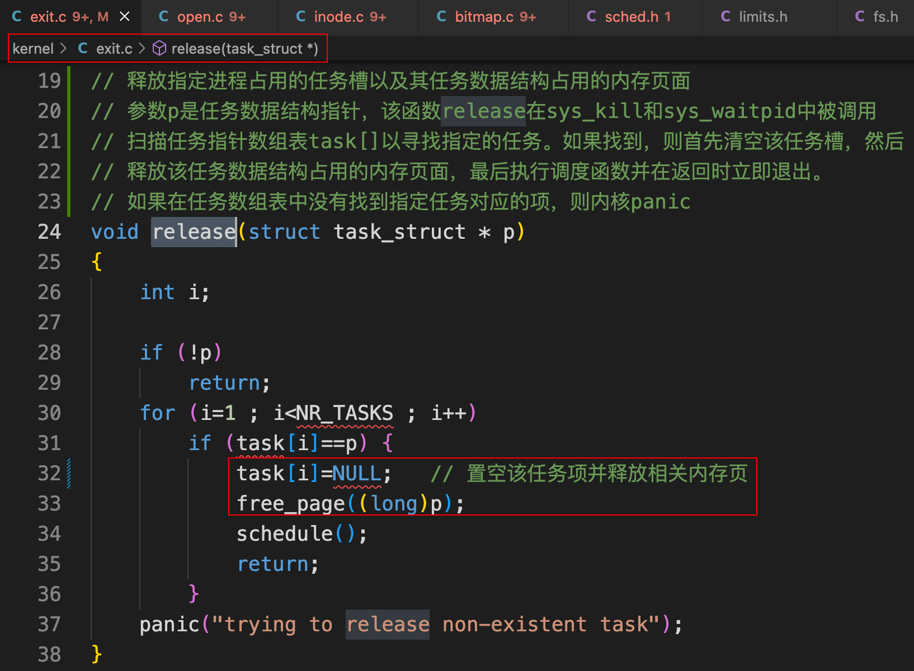
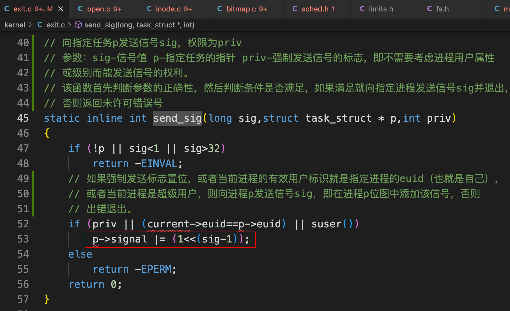
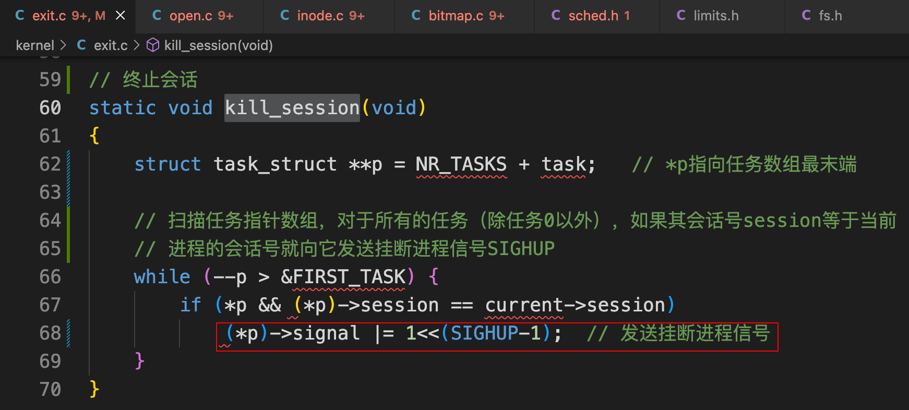
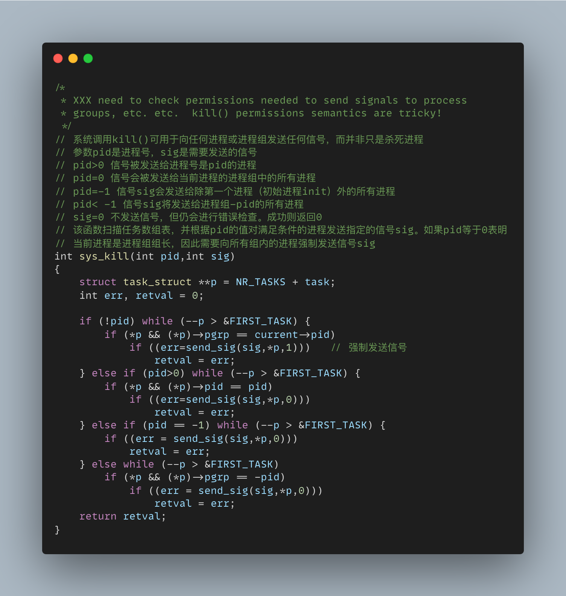
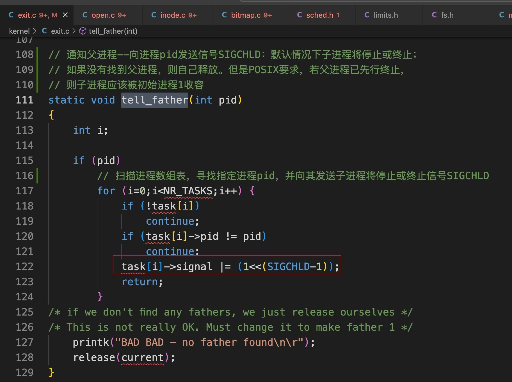
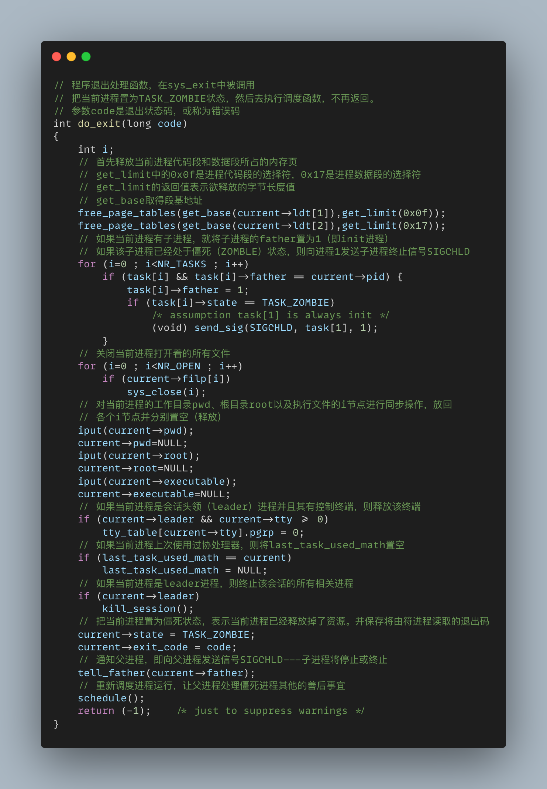
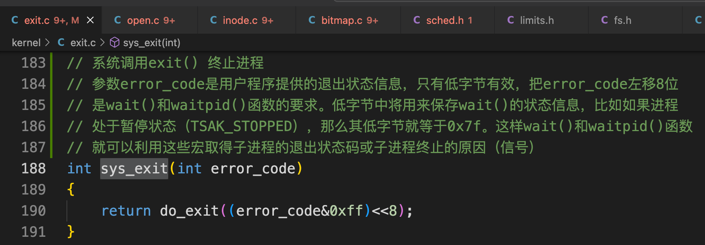
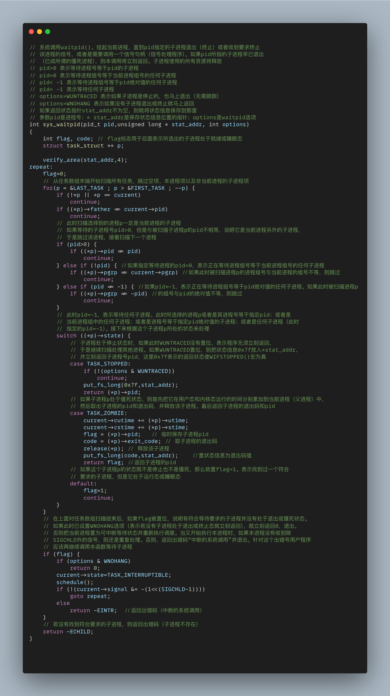

# 进程退出

## 1. kernel/exit.c

### 1.1 release

 

### 1.2 send_sig

 

### 1.3 kill_session

 

### 1.4 sys_kill

 

###  1.5 tell_father

 

### 1.6 do_exit

 

### 1.7 sys_exit

 

### 1.8 sys_waitpid

 

